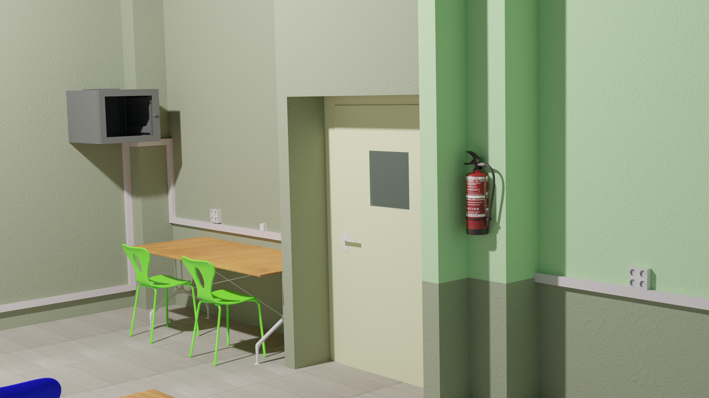

# Blender
## Apuntes de blender para el aula ATECA.

### **IES Arcipreste de Hita**

### **César San Juan Pastor**

## Unidades de trabajo del curso
[UT_1 Introducción](ut_1/ut_1_01.md)
[UT_2 Primeros pasos con Blender](ut_2/ut_2_01.md)

[Licencia](https://github.com/csanjuanp-ies/blender/blob/main/LICENSE)

## Bibliografía
- Blender 3D By Example: A project-based guide to learning the latest Blender 3D, EEVEE rendering engine, and Grease Pencil, 2nd Edition, ISBN 978-1789612561
- The Complete Guide to Blender Graphics Computer Modeling & Animation: Computer Modeling & Animation, 7ed, ISBN 978-1032121673
- Cycles Encyclopedia X, https://store.blender.org/product/cycles-encyclopedia/
