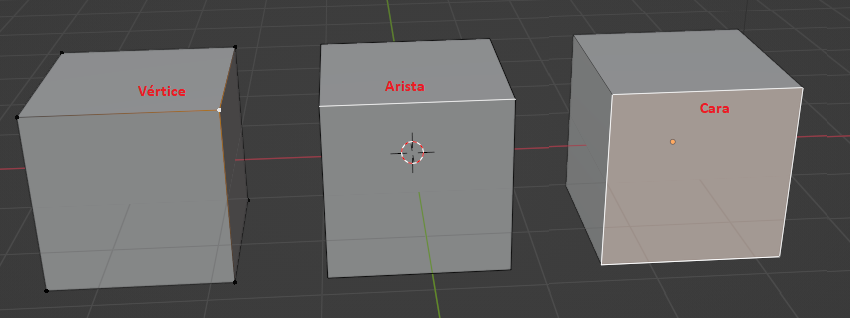
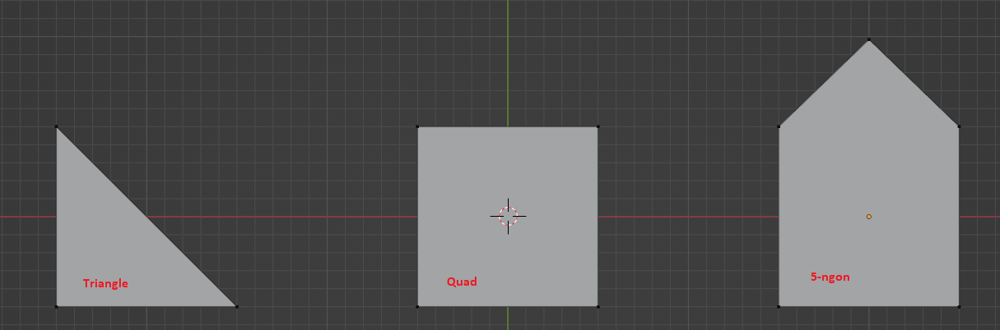
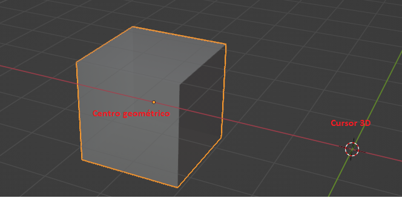

# U.T. 1 Introducción
## ¿Por qué usar Blender?
- Es libre
- Es potente
- Se usa en la industria
- Contiene todas las herramientas necesarias
- Es gratuito
  
## Diseño en 3D, introducción y conceptos
El diseño en 3D se entiende como todo diseño que utiliza para definir su contenido el espacio vectorial de tres dimensiones. Es decir, los objetos se definirán a través de puntos con tres coordenadas (x, y z) generando polígonos o caras para la definición de dichos objetos.

Una vez creados los objetos podrán ser modificados tanto a nivel global (desplazamientos, rotaciones, escalado, etc.) como a nivel local (transoformación de sus puntos, aristas o caras).

### Elementos de una escena 3D
Una escena es un conjunto de objetos 3D relacionados entre sí. Blender proporciona gestión para varias escenas en un mismo fichero pero no vamos a utilizarlo en estos apuntes.

Una escena puede contener varios tipos de objetos:
- Mallas. Elemento ya estudiado anteriormente, es el elemento más común.
- Elementos Vacios. Este tipo de elemento se utiliza de apoyo a los demás, no tienen interfaz visual.
- Luces. Como elmundo real, una escena en 3D necesita iluminación para poder ver el contenido. Por defecto Blender crea un luz para poder ver el trabajo que estamos realizando, pero no es la configuración más adecuada generalmente para un proyecto.
- Cámara. La escena tiene que capturarse a través de un objeto, la cámara, tal y como sucede en la vida real. Esta cámara tendrá propiedades y se podrá modificar su posición y otros aspectos importantes para capturar lo que se está visualizando.

### Elementos constituyentes de un objeto 3D
Todo objeto en 3D se definirá por los puntos que lo forman, que a su vez crearán arístas que uniendo al menos tres de ellas definirán una cara. El objeto mínimo que podemos definir es un **plano**, constituido por una cara y al menos tres vértices.

A continuación vemos los elementos constituyentes de cualquier objeto:
- Vértices (*vertex*).
- Aristas (*edge*).
- Caras (*face*).

Las caras se denominan en el diseño 3D polígonos, siendo estas triángulos (3 vértices *tri*), cuadrados (*quad*) o polígonos de más caras (*ngons*). El número máximo de vértices de una cara no está limitado, pero cuanto más elevado sea más compleja será la forma y por tanto la necesidad de procesamiento será mayor.

 

>Se debería mantener la complejidad de los polígonos lo más baja posible para minimizar el coste de uso de cpu. Pero aunque parezca que el mejor polígono para formar nuestro modelo sería el triángulo, no es así, se recomienda usar cuadrados o rectángulos en el mayor número posible de caras.

### Mallas
Un objeto estará constituido por múltiples caras unidas entre sí o no que le darán forma. Este conjunto de caras se denomina malla. La malla es la superficie del objeto que podemos manipular.

Es importante entender que la malla es un todo, es el objeto en sí, es lo que define nuestro objeto.

Cuando definimos la malla del objeto, podemos usar un número variable de caras en ella, pero siguiendo el principio anterior, intentaremos mantener la complejidad de la malla (número de caras) lo más bajo posible, mejorando tanto la respuesta a la hora de crear la escena fina, así como el uso de materiales (colores, texturas, etc.) en la malla.

### Centro geométrico o de pivotaje
 

Todo cuerpo tiene un punto geométrico ficticio que representa el centro de masas, dicho punto se denomina **centro geométrico**. En los programas de 3D el centro geométrico se utiliza como punto de referencia para realizar las transformaciones (rotaciones, escalado, etc.). Este punto se puede posicionar en cualquier lugar del espacio, pero es muy aconsejable que se encuentre en el objeto correspondiente, como el punto de referencia no tiene porqué coincidir con el centro geométrico real del objeto, lo denominaremos **centro de pivotaje**.

No hay que confundir el centro de pivotaje con el cursor 3D, que es un punto imaginario de blender en el que se llevarán las acciones del programa por defecto, por ejemplo al añadir un nueva malla se añaden en la posición del Cursor 3D.

### Materiales y texturas
Los objetos reales tienen colores y aspecto que definen lo que son. Del mismo modo en el diseño 3D deberemos dar esas características a nuestros objetos si queremos dotarlos de realismo.

Este aspecto incluye dos tipos de características que asignaremos a nuestros objetos: Los materiales y las texturas. Los primeros nos permitirán dar color y definir todos los aspectos de la relación entre la luz existente en la escena y nuestro objeto. Las segundas, son ficheros de imágenes que se aplicarán a diferentes partes de nuestros objetos.

En principio los materiales y las texturas parecen simnilares por poder conseguir efectos parecidos pero no es así:
- Los materiales contienen información para calcular sombras mientras las texturas no, simplemente se pintan como parte del objeto.
- Los materiales contienen toda la información necesaria para saber qué pasa cuando la luz llega a ellos, las texturas contendrán informacoón estática que no se puede actualizar en función de la luz que les llega.
- No se puede usar una textura para recrear un efecto de volumen dentro de nuestro objeto, un material sí.

## Instalación, requisitos y configuración
### Requisitos del programa
|Table| Syntax | Description |
| ----------- | ----------- |
| Header | Title |
| Paragraph | Text |

Minimum
64-bit quad core CPU with SSE2 support
8 GB RAM
Full HD display
Mouse, trackpad or pen+tablet
Graphics card with 2 GB RAM, OpenGL 4.3
Less than 10 year old
Recommended
64-bit eight core CPU
32 GB RAM
2560×1440 display
Three button mouse or pen+tablet
Graphics card with 8 GB RAM
Supported Graphics Cards
Always make sure to install the latest drivers from the graphics card manufacturer website. These requirements are for basic Blender operation, Cycles rendering using the GPU has higher requirements.

NVIDIA
GeForce 400 and newer, Quadro Tesla GPU architecture and newer, including RTX-based cards, with NVIDIA drivers (list of all GeForce and Quadro GPUs)

AMD
GCN 1st gen and newer. Since Blender 2.91, Terascale 2 architecture is fully deprecated, try using 2.90 (albeit not supported, it might still work) [list of all AMD GPUs]

Intel
Haswell architecture and newer. [list of all Intel GPUs]

macOS
Version 10.13 or newer for Intel processors on supported hardware. Version 11.0 for Arm-based processors (Apple Silicon).
**Ejercicio**
>1.- Crear una nueva escena en blender: **Archivo->Nueva->General**
2.- Desplazar el cubo: **Pulsar G -> desplazar con el ratón**
3.- Comprobar como se ha desplazado el **centro de transformación**
4.- Ver los elementos constituyentes: **Pulsar Tabulador**
5.- Utilizar el Gizmo de rotación: Parte superior derecha con los ejes dibujados. Pulsar y desplazar.
6.- Desplazar todos los vértices: **Pulsar G -> Desplazar**
7.- Comprobar como no se ha desplazado el **centro de transformación**
