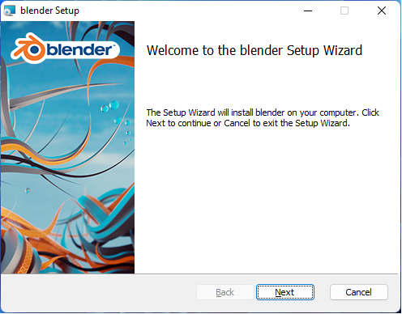
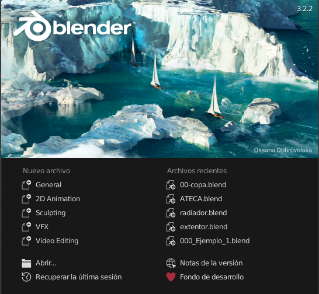

# U.T. 1 Introducción
## ¿Por qué usar Blender?
- Es libre
- Es potente
- Se usa en la industria
- Contiene todas las herramientas necesarias
- Es gratuito
  
## Diseño en 3D, introducción y conceptos
El diseño en 3D se entiende como todo diseño que utiliza para definir su contenido el espacio vectorial de tres dimensiones. Es decir, los objetos se definirán a través de puntos con tres coordenadas (x, y z) generando polígonos o caras para la definición de dichos objetos.

Una vez creados los objetos podrán ser modificados tanto a nivel global (desplazamientos, rotaciones, escalado, etc.) como a nivel local (transformación de sus puntos, aristas o caras).

### Elementos de una escena 3D
Una escena es un conjunto de objetos 3D relacionados entre sí. Blender proporciona gestión para varias escenas en un mismo fichero pero no vamos a utilizarlo en estos apuntes.

Una escena puede contener varios tipos de objetos:
- Mallas. Elemento ya estudiado anteriormente, es el elemento más común.
- Elementos Vacíos. Este tipo de elemento se utiliza de apoyo a los demás, no tienen interfaz visual.
- Luces. Como el mundo real, una escena en 3D necesita iluminación para poder ver el contenido. Por defecto Blender crea un luz para poder ver el trabajo que estamos realizando, pero no es la configuración más adecuada generalmente para un proyecto.
- Cámara. La escena tiene que capturarse a través de un objeto, la cámara, tal y como sucede en la vida real. Esta cámara tendrá propiedades y se podrá modificar su posición y otros aspectos importantes para capturar lo que se está visualizando.

### Elementos constituyentes de un objeto 3D
Todo objeto en 3D se definirá por los puntos que lo forman, que a su vez crearán arístas que uniendo al menos tres de ellas definirán una cara. El objeto mínimo que podemos definir es un **plano**, constituido por una cara y al menos tres vértices.

A continuación, vemos los elementos constituyentes de cualquier objeto:
- Vértices (*vertex*).
- Aristas (*edge*).
- Caras (*face*).

Las caras se denominan en el diseño 3D polígonos, siendo estos triángulos (3 vértices *tri*), cuadrados (*quad*) o polígonos de más caras (*ngons*). El número máximo de vértices de una cara no está limitado, pero cuanto más elevado sea más compleja será la forma y por tanto la necesidad de procesamiento será mayor.

 

>Se debería mantener la complejidad de los polígonos lo más baja posible para minimizar el coste de uso de CPU. Pero, aunque parezca que el mejor polígono para formar nuestro modelo sería el triángulo, no es así, se recomienda usar cuadrados o rectángulos en el mayor número posible de caras.

### Mallas (Mesh)
Un objeto estará constituido por múltiples caras unidas entre sí o no que le darán forma. Este conjunto de caras se denomina malla. La malla es la superficie del objeto que podemos manipular.

Es importante entender que la malla es un todo, es el objeto en sí, es lo que define nuestro objeto.

Cuando definimos la malla del objeto, podemos usar un número variable de caras en ella, pero siguiendo el principio anterior, intentaremos mantener la complejidad de la malla (número de caras) lo más bajo posible, mejorando tanto la respuesta a la hora de crear la escena fina, así como el uso de materiales (colores, texturas, etc.) en la malla.

La malla de un objeto, o mejor dicho la forma que tiene la malla se denomina topología. Mantener una topología simple nos quitará muchos problemas.

### Centro geométrico o de pivotaje
 

Todo cuerpo tiene un punto geométrico ficticio que representa el centro de masas, dicho punto se denomina **centro geométrico**. En los programas de 3D el centro geométrico se utiliza como punto de referencia para realizar las transformaciones (rotaciones, escalado, etc.). Este punto se puede posicionar en cualquier lugar del espacio, pero es muy aconsejable que se encuentre en el objeto correspondiente, como el punto de referencia no tiene porqué coincidir con el centro geométrico real del objeto, lo denominaremos **centro de pivotaje**.

No hay que confundir el centro de pivotaje con el cursor 3D, que es un punto imaginario de Blender en el que se llevarán las acciones del programa por defecto, por ejemplo, al añadir un nueva malla se añaden en la posición del Cursor 3D.

### Materiales y texturas
Los objetos reales tienen colores y aspecto que definen lo que son. Del mismo modo en el diseño 3D deberemos dar esas características a nuestros objetos si queremos dotarlos de realismo.

Este aspecto incluye dos tipos de características que asignaremos a nuestros objetos: Los materiales y las texturas. Los primeros nos permitirán dar color y definir todos los aspectos de la relación entre la luz existente en la escena y nuestro objeto. Las segundas, son ficheros de imágenes que se aplicarán a diferentes partes de nuestros objetos.

En principio los materiales y las texturas parecen similares por poder conseguir efectos parecidos, pero no es así:
- Los materiales contienen información para calcular sombras mientras las texturas no, simplemente se pintan como parte del objeto.
- Los materiales contienen toda la información necesaria para saber qué pasa cuando la luz llega a ellos, las texturas contendrán información estática que no se puede actualizar en función de la luz que les llega.
- No se puede usar una textura para recrear un efecto de volumen dentro de nuestro objeto, un material sí.

## Instalación, requisitos y configuración
### Requisitos del programa
| Mínimo | Recomendado |
| ------------- | ------------- |
| 64-bit quad core CPU with SSE2 support  | 64-bit eight core CPU  |
| 8 GB RAM  | 32 GB RAM  |
| Full HD display  | 2560×1440 display  |
| Mouse, trackpad or pen+tablet  | Three button mouse or pen+tablet  |
| Graphics card with 2 GB RAM, OpenGL 4.3  | Graphics card with 8 GB RAM  |
| Less than 10 year old  |  -  |
### Tarjetas gráficas soportadas
Para un uso óptimo de Blender deberemos tener siempre los últimos drivers de nuestra tarjeta actualiza, la necesidad de una tarjeta gráfica potente es imprescindible cuando nos adentramos en el mundo de la edición de vídeo, en caso de diseño es un requisito muy deseado, pero no indispensable.
**NVIDIA**
GeForce 400 y posteriores, Quadro Tesla GPU y posteriores, incluido RTX-based.

**AMD**
GCN 1st gen y posteriores. Desde Blender 2.91, La arquitectura Terascale 2 está obsoleta, en este caso usaremos la versión 2.90 

**Intel**
Haswell y posteriores. [list of all Intel GPUs]

### Descarga del programa
Podremos descargar el programa desde la siguiente url: [Blender.org](https://www.blender.org/download/). La versión con la que hemos trabajado estos apuntes es la versión **3.2**. Es muy probable si usamos otra versión que haya diferencias en el interfaz y en el flujo de trabajo para llevar a cabo las tareas, por lo que es recomendable usar esta versión.

### Instalación del programa
La instalación puede ser llevada de forma sencilla: una vez descargado ejecutamos el instalador y seguimos los pasos por defecto.

En caso de necesitar alguna configuración extra, o querer instalar de otra forma, podemos visitar: [Instalación bajo windows](https://docs.blender.org/manual/es/3.2/getting_started/installing/windows.html)

### Configuración del programa
Blender admite gran cantidad de configuraciones, en este momento solo nos centraremos en las más importantes: idioma, teclado y ratón. Para acceder a las configuraciones iremos al menú **Editar -> Preferencias**, una vez allí podemos ver las diferentes categorías, pero para el cambio del idioma nos dirigiremos a **Interfaz** y en la parte derecha buscaremos **Traducción**, podremos establecer el idioma a Español para el entorno. Del mismo modo, es imprescindible configurar el teclado si no tenemos la parte numérica en el nuestro, lo haremos en: **Editar->Entrada->Teclado->Emular teclado numérico**. Y por último, si no tenemos un ratón con tres botones, habilitaremos **Editar->Entrada->Ratón->Emular ratón de 3 botones**.  

## Ejercicios
**Ejercicio 1**
>1.- Crear una nueva escena en Blender: **Archivo->Nueva->General**
2.- Desplazar el cubo: **Pulsar G -> desplazar con el ratón**
3.- Comprobar cómo se ha desplazado el **centro de transformación**
4.- Ver los elementos constituyentes: **Pulsar Tabulador**
5.- Utilizar el Gizmo de rotación: Parte superior derecha con los ejes dibujados. Pulsar y desplazar.
6.- Desplazar todos los vértices: **Pulsar G -> Desplazar**
7.- Comprobar cómo no se ha desplazado el **centro de transformación**

**Ejercicio 2**
>1.- ¿Describe los cuatro elementos que puede tener una escena en Blender?
2.- ¿Elementos de un objeto en 3D?
3.- ¿Cuál es el mejor tipo de polígono para crear las mallas?
4.- ¿Diferencia entre centro de masas, centro de pilotaje y cursor 3D?
5.- ¿Diferencias entre un material y una textura?

**Ejercicio 3**
>1.- Crear una nueva escena en Blender: **Archivo->Nueva->General**
2.- Borra el cubo: **Pulsa Supr**
3.- Deshacer lo hecho: **Pulsar Ctrl+Z**
4.- Borra el cubo: **Pulsar X -> Borrar**
5.- Añade una esfera a la escena:**Pulsar Mayus + A -> Malla -> Esfera**
6.- Desplaza la esfera por el eje z: **Pulsa G + Z -> Desplazar el ratón**
7.- Cambia el tamaño de la esfera: **Pulsa S -> Desplazar el ratón**
8.- Guarda el fichero: **Menú Archivo -> Guardar -> Nombre Fichero -> Guardar**
9.- Crear una nueva escena.
10.- Carga la escena anterior: **Menú Archivo -> Abrir Reciente**

---
[Siguiente](ut_1_02.md)
