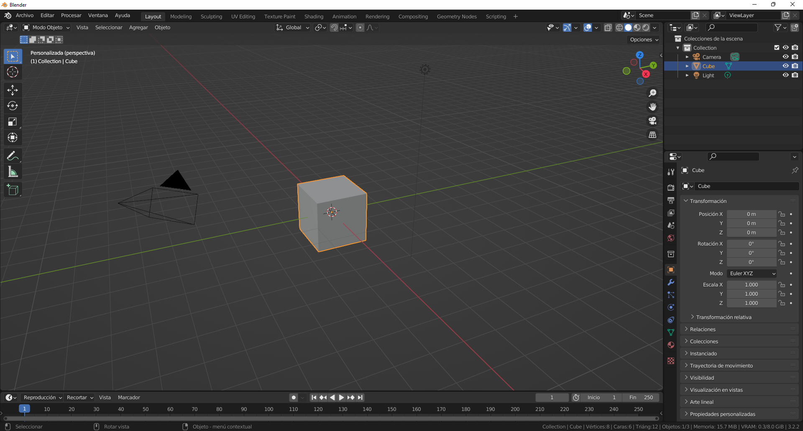
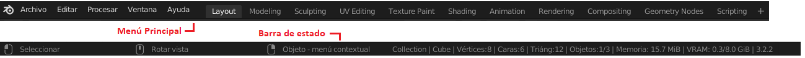
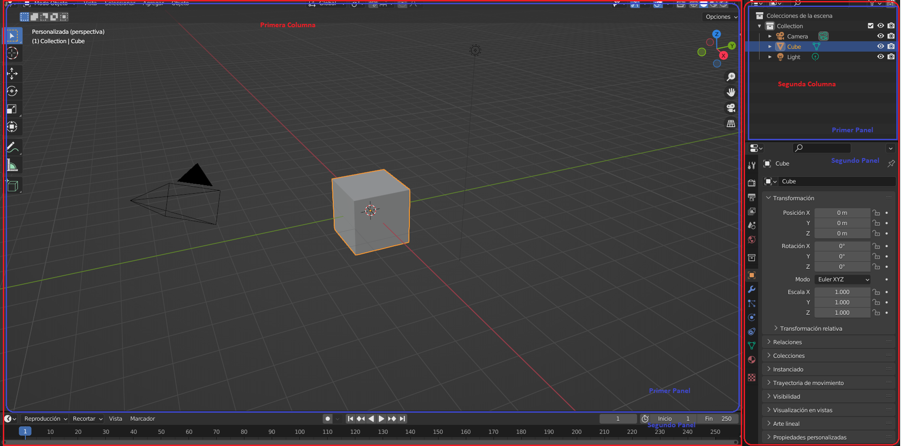
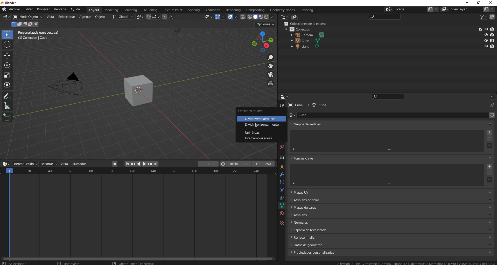
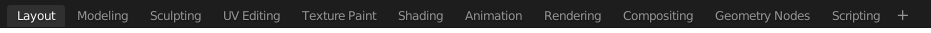
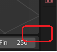

# U.T. 1 Introducción
## El interfaz

**A primera vista el interfaz parece intimidante**. Contiene multitud de menús, diferentes paneles, demasiados objetos, y no menos información. Y es así, para cualquier persona enfrentarse a Blender directamente es misión imposible, es imprescindible un estudio detallado del entorno y de sus funciones, así como de todas las posibles configuraciones que se pueden dar.

El interfaz de Blender se divide en tres áreas por defecto: El menú principal (en la parte superior), la barra de estado (en la parte inferior), y todo lo que queda entre estos elementos.

No es una manera muy "profesional" definir un área como: "todo lo que queda entre estos elementos", pero es así. La estructura que encontraremos entre estos elementos dependerá de nosotros mismos, pudiendo configurarla como queramos, almacenarla para posteriores usos e incluso importarla a otros ficheros si así lo necesitáramos.

Por defecto Blender crear una estructura de **dos columnas**, cada una de ellas dividida en **dos partes**. En la primera Columna aparece la vista en 3D y casi oculto, en la parte inferior una tira de números. En la segunda columna, a la derecha y más pequeña, aparece en la parte superior una estructura jerárquica con los objetos de la escena y justo debajo un panel de pestañas (los iconos que están apilados) con múltiples propiedades.

**Ejercicio**
>1.- Crear una nueva escena en Blender: **Archivo->Nueva->General** 
2.- Pulsar por los menús superiores. 
3.- Desplegar los objetos que conforman el cubo: Pulsar en el triángulo al lado del nombre en la parte superior derecha. 
4.- Pulsar en los diferentes iconos que hay en el panel de propiedades. 
5.- Situar el puntero en el icono que parece una cámara de fotos: ¿Qué etiqueta aparece? 
6.- Pulsar el puntero en el icono que parece una malla de color verde: ¿Qué etiqueta aparece? 
7.- Situar el cursor entre la separación de las dos columnas, pulsar y arrastrar. 
8.- Situar el cursor entre la separación de la vista en 3D y la tira de números inferior, pulsar y arrastrar. 
9.- Situar el cursor entre la separación de dos paneles cualquiera y pulsar con el botón derecho del ratón. 
10.- Guardar y cerrar Blender 
11.- Abrir Blender y cargar el fichero de este ejercicio. 
12.- Crear una nueva escena en Blender: **Archivo->Nueva->General**. 

Podemos ver a continuación cómo podría quedar el entorno tras el ejercicio anterior. No pasa nada, al crear una nueva escena se parte de cero. Pero no desaparece toda configuración que hayamos hecho, si grabamos el fichero esta configuración permanecerá y se establecerá cada vez que abramos dicho fichero.

### Barra de menú
La barra de menú muestra el conjunto de menús de la aplicación, los espacio de trabajo definidos y el control de escenas y capas. Los menús los iremos descubriendo a lo largo de todo el curso; los espacio de trabajo los explicaremos en esta unidad de trabajo posteriormente y las escenas y capas no las vamos a utilizar en estos apuntes.

### Barra de estado
La Barra de Estado está ubicada en la parte inferior de la ventana de Blender y muestra información contextual como atajos de teclado, mensajes e información estadística. Entre la información más relevante que muestra de izquierda a derecha es: Información del mapa de teclado, mensajes de estado e información sobre los recursos. 

### Modificaciones del interfaz
El interfaz puede crearse a gusto de usuario y guardarse para posteriores usos. En la barra de menú tenemos ya establecidos varios espacios de trabajo por defecto (workspaces) justo al lado de los menús. Podemos cambiar nuestro aspecto simplemente seleccionando uno de los espacios de trabajo por defecto.

Tras probar todos los espacios pulsando en cada uno de ellos dejaremos el espacio por defecto en Layout y crearemos el nuestro propio pulsando el botón **+** situado al final de los workspaces. Se abre un menú que permite crear una disposición por defecto, nosotros usaremos *duplicar activo*. Una vez realizado este paso se selecciona el nuevo espacio de trabajo.

Para cambiar el aspecto de nuestro espacio de trabajo, pulsaremos con el botón derecho del ratón en las divisiones de áreas, haciendo que aparezca un menú con las opciones:
- Dividir verticalmente.
- Dividir horizontalmente.
- Unir áreas.
- Intercambiar áreas.

Con las cuatros opciones y repitiendo el proceso sobre el borde que nos interese podemos cambiar el aspecto a nuestro gusto. También se puede cambiar los tamaños de las áreas con simplemente pulsar y arrastrar con el botón izquierdo del ratón sobre el borde que necesitemos modificar.

Por último, situando el cursor en cada una de las esquinas redondeadas del interfaz, veremos que cambia a una cruz, con la que si pulsamos y arrastramos podremos: dividir el área actual en dos (arrastrando hacia el área actual) o unir a un área colindantee (arrastrando hacia el área a unir).

No son los únicos métodos para cambiar el interfaz, pero como veremos a lo largo de todo el curso, Blender proporciona multitud de mecanismos para hacer una tarea, debiendo ser nosotros los que decidamos cuáles utilizar ([Áreas](https://docs.blender.org/manual/es/3.2/interface/window_system/areas.html)).

---
[Siguiente](ut_1_03.md)
