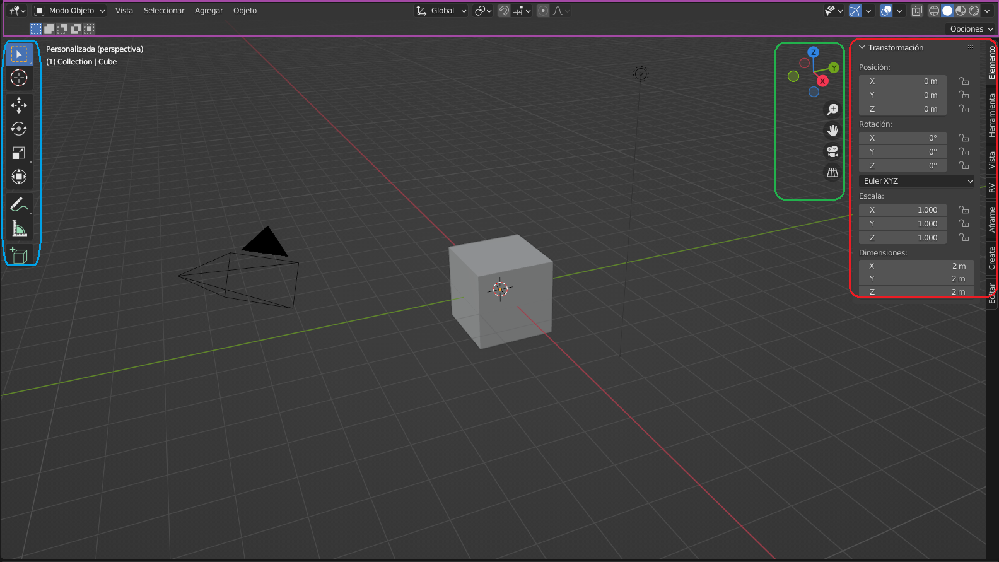

# U.T. 1 Introducción
- [U.T. 1 Introducción](#ut-1-introducción)
  - [Editores](#editores)
    - [Vista 3D](#vista-3d)
    - [Editor de imágenes](#editor-de-imágenes)
    - [Editor de UV](#editor-de-uv)
    - [Nodos de sombreado](#nodos-de-sombreado)
    - [Listado](#listado)
    - [Propiedades](#propiedades)
    - [Explorador de archivos](#explorador-de-archivos)
## Editores
Una vez hemos configurado la estructura de nuestro espacio de trabajo, podemos establecer dentro de cada área un editor diferente. Un editor es una pequeña aplicación que trata un aspecto concreto de la edición en 3D.

En la imagen anterior vemos todos los editores disponibles en Blender. El cambio es muy sencillo, pulsamos en le botón que aparece en la esquina superior izquierda (en azul en la imgen) para desplegar el menú y elegimos el que nos interese. Repetiremos el proceso con todas las áreas de nuestro workspace.

**Ejercicio**
>1.- Crear un workspace similar a la siguiente figura

El número de flujos de trabajo que implementa Blender es muy numeroso, pero en nuestro caso nos centraremos en el diseño de escenas en 3D que posteriormente podremos llevar a un navegador WEB e interactuar con ellas mediante javascript. Al tener este objetivo en concreto, muchos de los editores existentes no nos son interesantes, en concreto nos centraremos en:
- Vista 3D.
- Editor de imágenes.
- Editor de UV.
- Nodos de sombreado.
- Listado.
- Propiedades.
- Explorador de archivos.

### Vista 3D
Este editor permite trabajar la escena con una visión 3D, desplazándonos por ella e interaccionando con los diferentes componentes para su modificación.

La zona superior (morado) contiene *menús* de izquierda a derecha:
- El selector de editores (comentado en el punto anterior).
- El selector del modo. Esta lista nos permitirá cambiar entre el modo objeto y el modo edición. El primero para modificar de forma global el objeto, el segundo modifica los componentes internos (vértices, aristas y caras) de forma individual.
- Menús del editor (Vista, Seleccionar, Agregar y Objeto).
- Controles de transformación.
- Controles de visualización y sombreado.

La zona izquierda (azul) contiene *la barra de herramientas*. En la barra aparecerán las herramientas que podemos usar dependiendo del modo actual (objeto o edición). Por defecto esta barra está colapsa y solo muestra iconos, si pulsamos en el borde y arrastramos veremos que aparecen los nombres de las herramientas. Además, algunos iconos tienen un triángulo en la parte inferior que significa que es un contenedor de herramientas y muestra la seleccionada. Esto quiere decir que si pulsamos en dicho icono prolongadamente aparecerán más herramientas. Por último, la barra se puede esconder pulsando la tecla **T**.

La zona derecha alberga dos controles, Los controles de visualización (verde) y la barra lateral (rojo). 

*Los controles de visualización* permiten modificar la vista de usuario del editor, rotando a través del mundo (ejes coordenados) al pulsar y arrastrar; hacer zoom para acercarnos a los objetos (lupa); desplazar la vista (mano); pasar a vista de cámara (la cámara) e intercambiar entre la vista perspectiva y ortogonal.

*La barra lateral* contiene información relevante a proyecto. Podemos apreciar que tiene una serie de pestañas en la parte derecha que permiten ver las propiedades a sociadas. En nuestro caso son importante de momento: elemento, herramienta y vista. *Elemento* mostrará los datos del objeto actual, si modificamos las propiedades en esta pestaña se modifica el elemento. *Herramienta* muestra las propiedades de la herramienta actual selecionada pudiendo configurar todos sus parámetros. *Vista* contiene el panel *cursor 3D* que nos permitirá de forma rápida posicionarlo en el centro de la escena estableciendo los valores x, y,z a cero.

**Ejercicio**
>1.- Desplazarse por todas las zonas, usando todo lo existente en el interfaz. 
2.- Usar las teclas **T** y **N** varias veces. 
3.- Cambiar el tamaño de la barra de herramientas, colapsarla completamente y volverla mostrar. 
4.- Usar los controles de visualización. 
5.- Cambiar los valores del cubo x e y a 10. 

### Editor de imágenes
Con una estructura similar al visor 3D, permite hacer modificaciones simples a nuestros ficheros de imagen. No permite grandes proezas pero sí modificiones simples que nos eviten tener otro programa gráfico como [Krita](https://krita.org/es/).

### Editor de UV
El Editor UV se usa para mapear elementos 2D como imágenes o texturas sobre objetos 3D y editar las llamadas coordenadas UV. La idea es tomar una malla tridimensional (X, Y, Z) y desenvolverla sobre una imagen bidimensional, permitiendo que dicha imagen se acople al objeto 3D perfectamente a la hora de hacer la imagen final. 

La estructura es similar al visor 3D y se suele acceder a través del workspace **UV Editing**. 

>Si vemos que algún menú no muestra todos los elementos posibles, podemos hacerlos aparecer situando el botón de ratón en la barra de menú y desplazando con la rueda del ratón.

### Nodos de sombreado
Se utiliza para la creación de materiales para los objetos. Blender presenta un sistema muy complejo basado en nodos para la creación de los materiales que veremos en una unidad de trabajo separada más adelante.

### Listado
El listado es un editor que organiza los datos de la escena. Situado generalmente en la parte derecha se utiliza muy amenudo para la gestión de la visualización (si bien un objeto seleccionado se puede ocultar con la tecla **H**) entre otras muchas tareas.

En este editor podremos:
- Ver los datos en la escena.
- Buscar objetos en la escena a través de la caja de búsqueda con la lupa.
- Copiar, mover o borrar a través del menú contextual del objeto pulsando con el botón derecho del ratón.
- Seleccionar y anular la selección de objetos en la escena. Con la tecla Control y el botón izquierdo del ratón podremos incorporar o eliminar elementos de la selección actual.
- A continuación de cada elemento aparecen tres iconos con los que podremos: 
  - Ocultar o mostrar un objeto en la escena (icono del opción de selección).
  - Habilitar o deshabilitar la selección (icono del ojo).
  - Habilitar o deshabilitar el procesado de un objeto (icono de la cámara).
  - Si pulsamos el icono que parece un embudo (superior derecha, en azul en la imagen anterior), se muestran más opciones que podemos hacer que se muestren a continuación de los iconos anteriores, así como opciones de filtro para los objetos del listado.
- Eliminar objetos de la escena. Seleccionando un objeto y pulsando **X** o la tecla **Supr**.
- Desplazar elmentos seleccionados con el botón izquierdo del ratón y arrastrando a la nueva posición.
- Administrar colecciones en la escena. Una colección es un cajón para organizar objetos. Estas colecciones se crean con el menú contextual y se tratan como si fueran un único objeto.
- Desplegar o ocultar los datos de un objeto pulsando el triángulo que aparece a la izquierda del nombre.

### Propiedades

La pestaña de propiedades nos permite editar la mayoría de las propiedades tanto de la escena como de los objetos. Decimos la mayoría ya que hay ciertas características, por ejemplo cuando empezamos a trabajar con nodos que no son accesibles desde esta pantalla.

La parte izquierda (verde) vemos un conjunto de iconos que cada uno de ellos representa una pestaña diferente y a una parte de la escena diferente. La pestaña seleccionada tendrá un fondo más oscuro (círculo rojo).

Las propiedades aparecen a la izquierda (azul) organizadas por paneles que se pueden extender o contraer (> al lado del nombre) al pulsar. La mayoría de las propiedades las veremos a lo largo de este manual.

### Explorador de archivos
Este editor implementa las operaciones básicas de un diálogo de archivos: selección y nombrado de archivos.

---
[Siguiente](ut_1_04.md)