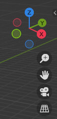
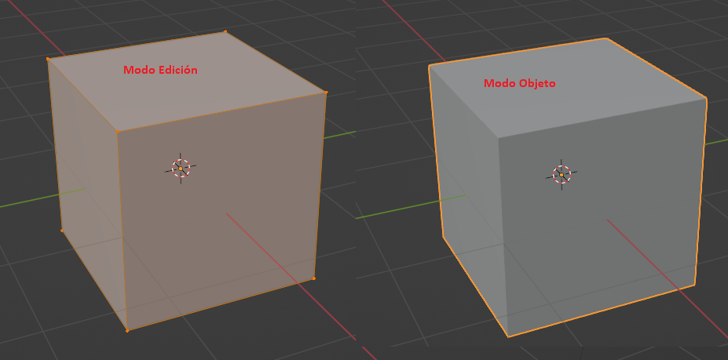
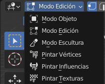
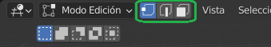

# U.T. 1 Introducción
## Navegación en el entorno 3D
El posicionamiento en el entorno 3D es fundamental para diseñar correctamente. Las diferencias con un trabajo en 2D son fundamentales, ya que el entorno nos sitúa en un punto de nuestra escena mostrándonos solo aquello que queda dentro de nuestro campo de visión.

Los movimientos que generalmente se realizan para posicionarnos son los siguientes:
- **Rotar**. La mejor manera de entender cada momvimiento es usándolo. Localicemos en la parte derecha del visor 3D el gizmo de rotación (Ver imagen anterior). Pulsando con el ratón sobre cualquier punto de los ejes y desplazando veremos como la vista cambia. Este movimiento orbital es muy util para ver la escena desde diferentes ángulos. También podemos pulsar sobre los círculos de color para situar ese punto de vista directamente. Generalmente, según vamos avanzando con el uso del programa utilizaremos cada vez más acelereadores de teclado. En este caso usaremos la pulsación del botón central de ratón y arrastre del mismo para realizar la misma acción. 
- **Zoom**. El zoom permite acercanos o alejarnos de los objetos. En los botonos aparecen justo debajo de los ejes, como un icono de una lupa e el que al pulsar y arrastrar arriba o abajo cambiará el nivel de zoom, con el ratón usaremos la rueda centra desplazándola, sin pulsarla.
- **Mover**. Esta acción mueve la escena de forma lateral, bien usando el icono de la mano y arrastrando o usando la combinación de teclas Mayúsculas + botón central del ratón y arrastrando.

El posicionamiento como hemos dicho es crucial para realizar correctamente el diseño, y a parte de las acciones anteriore y de usar la ocultación de diversos objetos (*H* o panel de propiedades), tenemos algunas opciones más que debemos explorar para dominar el posicionamiento.

- **Zoom a un área Ctrl+B**. Esta acción permite centrarnos en una parte muy concreta de la imagen haciendo zoom. Habrá veces que veremos que el zoom no es capaz de acercarse más a los objetos, en estos casos tenemos esta opción o la siguiente. Una vez pulsemos el atajo de teclado cambia el cursor indicándonos que tenemos que dibjuar un rectángulo pulsando y arrastrando para indicar el área en el que queremos centrarnos.
- **Vista local**. La vista local permite centrarnos en un objeto concreto ocultando temporalmente el resto. Con el objeto seleccionado (clic en el objeto y rodeado de un borde naranja) nos vamos al menú *Vista -> Vista Local -> Altenar vista local*. Para eliminar el zoom que se realiza volvemos a utilizar el mismo menú.

Con todas las opciones de navegación estudiadas tenemos un manejo bastante completo del entorno, pero en escenas complejas nos faltará un movimiento más. El desplazarse por la escena como se estuviéramos dentro puede ser muy útil cuando esta sea grande. Este desplazamiento se denomina Transitar o Volar por la escena. No es la misma funcionalidad pero la finalidad sí. 

Al **Transitar** (Menú Vista -> Navegación -> Transitar) El cursor cambia y podemos usar las teclas a, w, s, d para dar impulso al movimiento en las cuatro direcciones y el ratón para mover el punto de destino. Este movimiento simula el que haríamos nosotros andando por la escena. Si el movimiento es muy lento, el scroll de la ruda del ratón controla la velocidad del mismo.

Al **Volar** permite realizar un movimiento similar al que hace un pájaro a través de la escena. La rueda vuelve a controlar la velocidad, pero en este caso el ratón es el que establece la dirección exclusivamente. El cuadrado que aparece nos sirve de guía para indicar la dirección y controlarla, cuanto más alejado esté el cursos en cualquier dirección, más acentuado será el movimiento que junto con el desplazamiento de la rueda central completará todo lo necesario para realizarlo. Este desplazamiento es un poco más complejo que el anterior y se recomienda practicarlo mucho.

### El teclado numérico
El teclado numérico contiene aceleradores que facilitan el posicionamiento de la vista rápidamente:
- El botón inicio. Hace que se encuadre toda la escena.
- La barra invertida / cambia entre la vista local.
- El 0 nos cambia a la vista de cámara, al igual que el icono que aparece abajo del gizmo de desplazamiento (una cámara).
- El 5 cambia entre la perspectiva y la vista ortogonal, al igual que el icono que aparece como ujna rejilla debajo del gizmo de desplazamiento.
- El resto de números también tienen una función, así como al utilizarlos junto con las teclas Mayúsculas y Control. Para ver los uso la mejor manera es desplazarse al menú **Vista** y comprobar todas las opciones como sus aceleradores que los encontraremos a la derecha del nombre.

>**Perspectiva frente a Ortogonal**
Generalmente tendremos nuestra vista en modo perspectiva el 99% del tiempo, pero no está de más ver las diferencias con la vista ortogonal. En la vista en perspectiva la escena se ve como nosotros la veríamos en la realidad, con los objetos cambiando de tamaño según la posición relativa a la nuestra y pareciendo que las líneas paraleas convergen en un punto en el infinito. Sin embargo, la vista ortogonal muestra todos los objetos en su tamaño real independientemente de su posición y con todas las líneas paralelas correctamente, con lo que parece distornsionarse los objetos, la ventaja de este modo es que podemos comparar rápidamente tamaños de distintos objetos independientemente de su posición.

## Modos de vista del visor 3D
Ya hemos mencionado varias veces que la mayor parte de nuestro diseño la pasaremos en este visor. Proporciona dos modos de trabajo con nuestros objetos: Objeto y Edición. En el primero los cambios se realizarán de forma global al objeto, a todos sus componentes, en el segundo permite cambios locales, a vértices, aristas o caras indivisualmente.

El modo Objeto se entra por defecto, y cuando se selecciona un objeto se hace todo él, con un borde naranja alrededor del mismo. Para entrar en el modo Edición, es imprescindible tener seleccionado un objeto y pulsar la telca **TAB**. Veremos que en principio cambia la visión aunque nuestro objeto sigue completamente naraja, aparecen nuevos elementos: los vértices.

Además del atajo de teclado, podemos usar la lista en la barra de menú del visor para cambiar entre ambos modos.

Como podemos apreciar en la imagen hay más modos, algunos de ellos hablaremos más adelante, pero por ahora son suficientes estos dos.

### El modo Edición
El modo edición, como hemos dicho, permite realizar transformaciones locales de los elementos del objeto. Por defecto el sistema nos permite seleccionar vértices (los puntos naranjas), pero nada nos impide hacer seleciones de aristas o de caras. Para cambiar el modo de selección pulsamos cualquiera de los tres iconos que aparecen a la izquierda de la lista de selección de modo (verde).

De izquierda a derecha: selección de vértices, de aristas y de caras. Adicionalmente podemos usar los atajos de teclado: 1, 2 y 3 para realizar la misma selección. Veremos que cambia la forma que el objeto seleccionado se muestra en función del tipo de selección.

---
[Siguiente](ut_1_05.md)