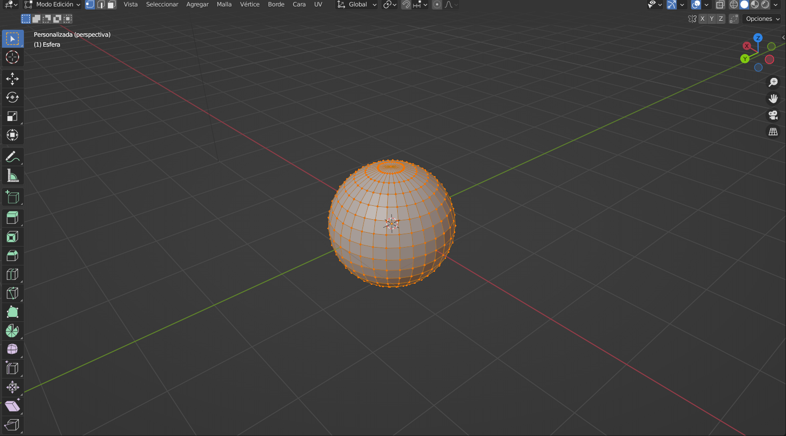
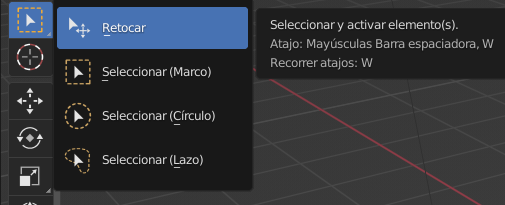
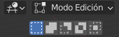
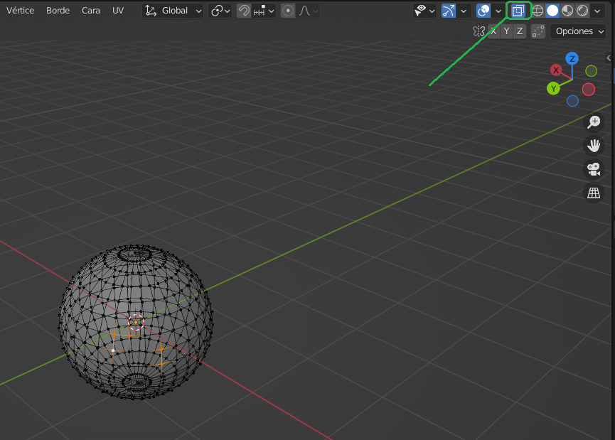
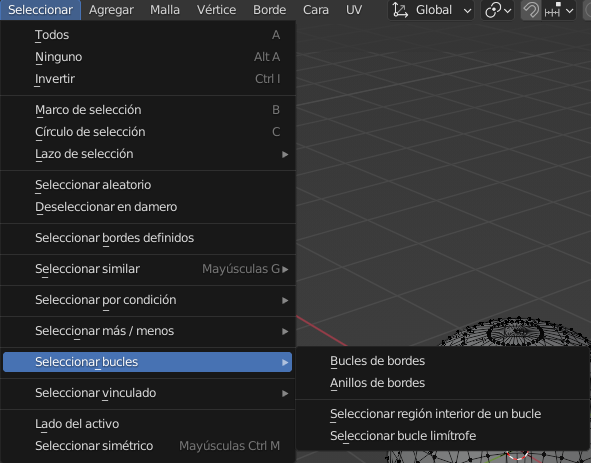
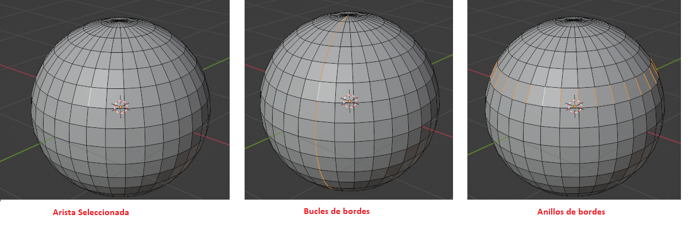
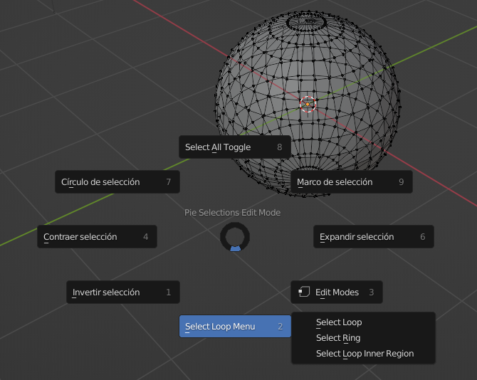

# U.T. 1 Introducción
## Selección de objetos
El determinar sobre qué objetos (Modo Objeto) o qué parte del objeto (Modo Edición) van a recaer nuestras acciones es primordial para un buen diseño. A continuación vamos a ver los posibles mecanismos de selección que podemos usar. Para comprender mejor estos mecanismos nos pondremos en el modo Edición y añadimos una esfera al entorno tras borrar el cubo.

>1-.- Crear escena general. 
2.- Seleccionar el cubo 
3.- Borrar el cubo (**X** o **Suprimir**) 
4.- Añadir la escena la esfera: **Agregar -> Malla -> Esfera**. 
5.- Pasar al modo Edición: **Tab**. En caso que no pase nada hay que asegurarse que la esfera está selecionada, con el borde naranja.

> **Pulsar en cualquier parte de la escena que no sea la esfera para eliminar la selección actual.**

### Barra de herramientas

El primer botón de la barra de herramientas son las herramientas de selección. Haciendo una pulsación larga aparece el menú de la imagen, en el que hay cuatro herramientas, las tres últimas nos sirven para seleccionar:
- A través de un marco, pulsando y arrastrando con el ratón.
- Mediente un círculo. El cursor cambia a un círculo de selección cuyo tamañpo se controla con la rueda central del ratón. Este mecanismo seleccionará todo lo que esté dentro del círculo.
- Con un lazo de dibujo libre.

>**Utilizar las tres herramientas vistas sobre la esfera.**

Podemos comprobar dos cosas, la primera que cada vez que usamos la herramienta la selección anterior desaparece, y segundo, si rotamos la escena tras una selección, veremos que los vértices posteriores no se han seleccionado

### Ctrl, Alt
Para poder añadir o eliminar elementos a nuestra selección tenemos estas dos teclas que la usaremos a la vez que la herramienta seleccionada. La primera elimina de la selección actual y la segunda añade a la selección actual.

>**No nos olvidemos que podemos seleccionar en cualquier modo: vértice, arista o cara**

Si deseamos controlar qué va a pasar con los nuevos objetos sobre la selección actual sin usar teclas, tenemos a nuestra disposición en la parte superior izquierda tres botones que controlan dicho comportamiento (de izquierda a derecha):

- Crear una nueva selección (en azul).
- Añadir a la selección, similar a la tecla **Alt**.
- Eliminar de la selección, similar a la tecla **Ctrl**.
- Invertir la selección actual.
- Intersección con la selección actual.

### Modo alambre
Hemos mencionado que cuando hacemos una selección por defecto solo se realiza sobre lo visible, todos los objetos que están dentrás no se seleccionan. Para cambiar este comportamiento podemos pasar temporalmente al modo alambre, en el que se visualizarán todos los objetos seleccionables y se usarán todos.

Podemos ver en la imagen que se pueden visulizar todos los vértices de la esfera, incluso los que están detrás. Si ahora hacemos una selección todos ellos quedarán seleccionados. El único problema de esta forma de trabajar es que añade complejidad a la visualización, con lo que es muy recomendable utilizarla solo para la selección y después trabajar en el modo sólido.

### Menú selección en visor 3D

En la imagen anterior vemos la gran cantidad de opciones disponibles para la selección, deberíamos hacer uso de ellas y saber cómo funcionan. No tenemos tiempo de hacer un estudio detallado de ellas, pero sí mencionaremos la selección en bucles por ser muy últil. Para poder entenderlo mejor se debe pasar a la selección en aristas.
- Bucles de bordes, con una arista seleccionada, seleccionará el círculo que la completa, el sentido lo determina la dirección de la arista.
- Anillos de bordes. Al igual que antes, con una arista seleccionada, seleccionará el círculo que la completa, pero el sentido ahora será perpendicular a la dirección de la arista seleccionada.

### Tecla **A**

Estando en le modo edición, podemos pulsar la tecla **A** para mostrar un menú circular que nos muestra aceleradores de selección. De estos el que aparece en la parte superior (Select All Toggle) hace que se seleccionen todos los elementos o se borre completamente la selección. El resto queda explicado con su nombre.

>[Selección en el Manual de Blender](https://docs.blender.org/manual/es/3.2/modeling/meshes/selecting/introduction.html)

El modo Objeto tiene herramientas similares.
>[Selección en el Manual de Blender](https://docs.blender.org/manual/es/3.2/scene_layout/object/selecting.html)

## Introducción a la transformación de objetos
- Rotación
- Desplazamiento
- Escalado
- Transformación
- En modo Edición
  - Las anteriores, diferencias
  - Extruir caras

## Creación de nuevos objetos
- Mayúsculas + A
- Menú Agregar
- Diferentes tipos
  - Mallas
  - Curvas
  - Vacíos
  - Imagen
  - Luz
  - Cáamra
- Duiplicar objetos
## Grabación del fichero y copias de seguridad
- Grabar el fichero, extensión .blend
- Recuperar últimos ficheros
- Recuperar última sesión
- Recuperar auto guardado
- Ficheros con extensión .blend1

---
[Siguiente](ut_1_06.md)