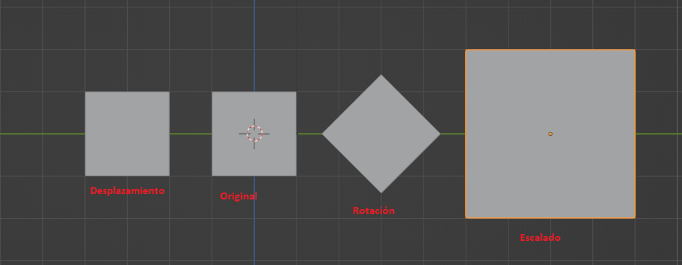
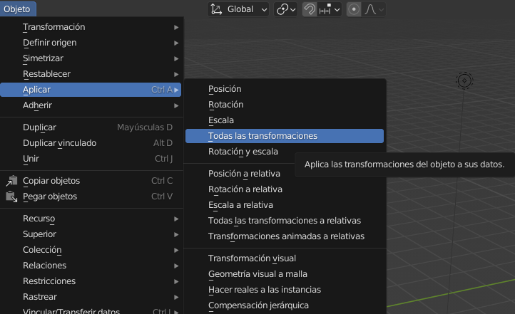
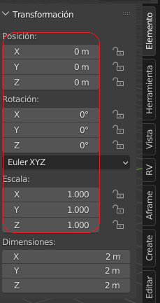
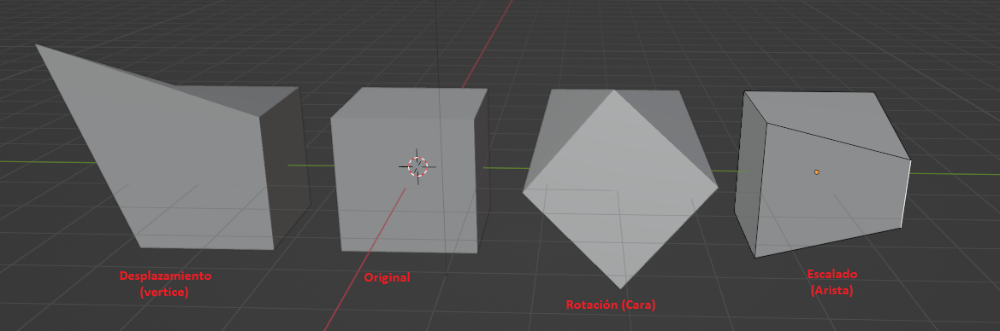
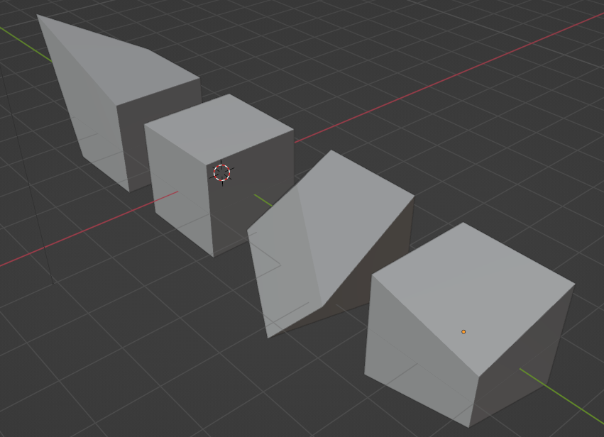
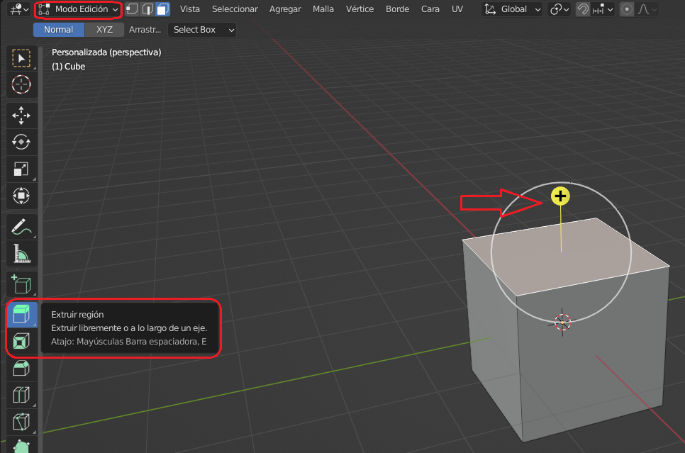
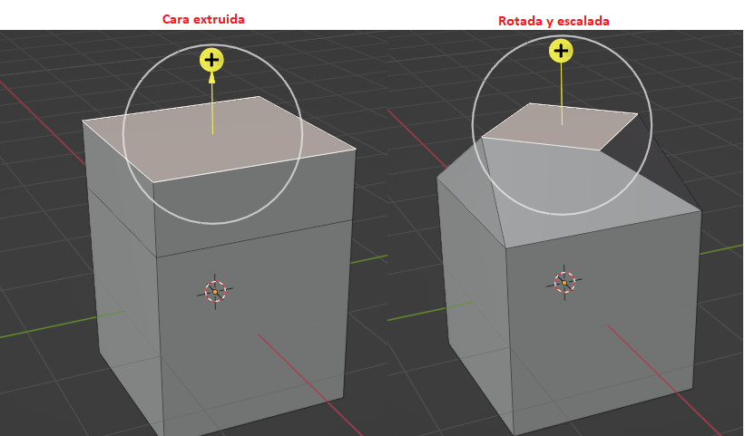
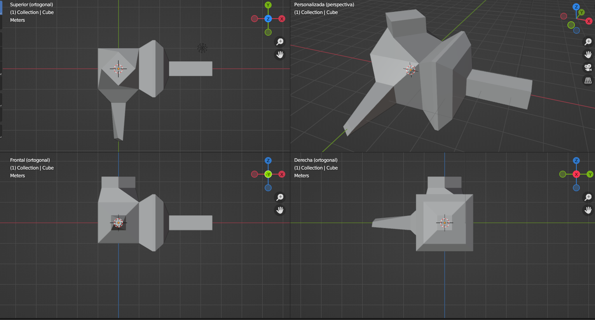
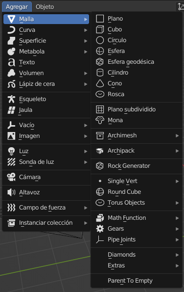
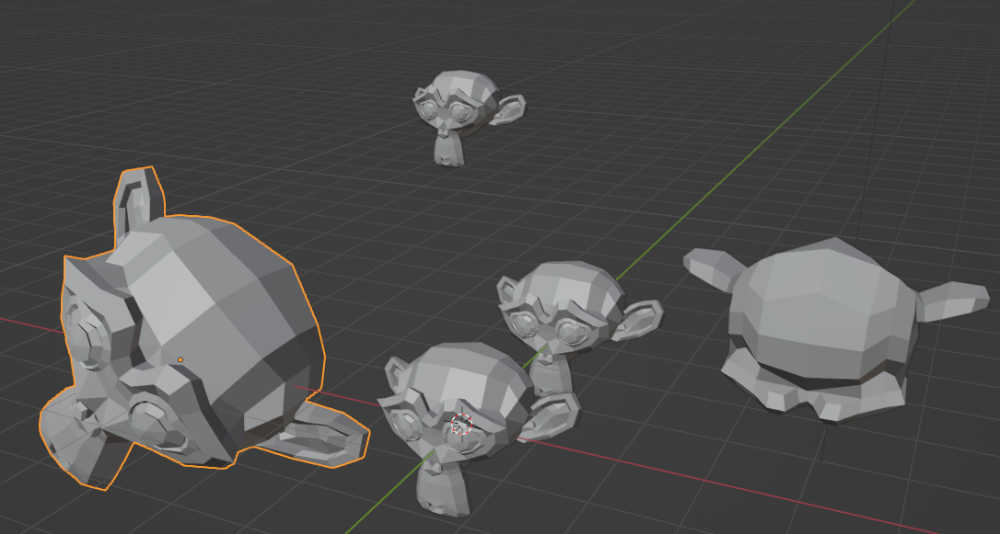

# U.T. 1 Introducción
- [U.T. 1 Introducción](#ut-1-introducción)
  - [Selección de objetos](#selección-de-objetos)
    - [Barra de herramientas](#barra-de-herramientas)
    - [Ctrl, Alt](#ctrl-alt)
    - [Modo alambre](#modo-alambre)
    - [Menú selección en visor 3D](#menú-selección-en-visor-3d)
    - [Tecla **A**](#tecla-a)
  - [Introducción a la transformación de objetos](#introducción-a-la-transformación-de-objetos)
    - [Edición](#edición)
    - [Extruir caras](#extruir-caras)
  - [Creación de nuevos objetos](#creación-de-nuevos-objetos)
    - [Duplicar objetos](#duplicar-objetos)
  - [Grabación del fichero y copias de seguridad](#grabación-del-fichero-y-copias-de-seguridad)
    - [Recuperar últimos ficheros](#recuperar-últimos-ficheros)
    - [Recuperar última sesión](#recuperar-última-sesión)
    - [Anexar o vincular](#anexar-o-vincular)
    - [Importar y exportar](#importar-y-exportar)
## Selección de objetos
El determinar sobre qué objetos (Modo Objeto) o qué parte del objeto (Modo Edición) van a recaer nuestras acciones es primordial para un buen diseño. A continuación, vamos a ver los posibles mecanismos de selección que podemos usar. Para comprender mejor estos mecanismos nos pondremos en el modo Edición y añadimos una esfera al entorno tras borrar el cubo.

>1.- Crear escena general. 
2.- Seleccionar el cubo 
3.- Borrar el cubo (**X** o **Suprimir**) 
4.- Añadir la escena la esfera: **Agregar -> Malla -> Esfera**. 
5.- Pasar al modo Edición: **Tab**. En caso que no pase nada hay que asegurarse que la esfera está seleccionada, con el borde naranja.

> **Pulsar en cualquier parte de la escena que no sea la esfera para eliminar la selección actual.**

### Barra de herramientas

El primer botón de la barra de herramientas son las herramientas de selección. Haciendo una pulsación larga aparece el menú de la imagen, en el que hay cuatro herramientas, las tres últimas nos sirven para seleccionar:
- A través de un marco, pulsando y arrastrando con el ratón.
- Mediante un círculo. El cursor cambia a un círculo de selección cuyo tamaño se controla con la rueda central del ratón. Este mecanismo seleccionará todo lo que esté dentro del círculo.
- Con un lazo de dibujo libre.

>**Utilizar las tres herramientas vistas sobre la esfera.**

Podemos comprobar dos cosas, la primera que cada vez que usamos la herramienta la selección anterior desaparece, y segundo, si rotamos la escena tras una selección, veremos que los vértices posteriores no se han seleccionado

### Ctrl, Alt
Para poder añadir o eliminar elementos a nuestra selección tenemos estas dos teclas que la usaremos a la vez que la herramienta seleccionada. La primera elimina de la selección actual y la segunda añade a la selección actual.

>**No nos olvidemos que podemos seleccionar en cualquier modo: vértice, arista o cara**

Si deseamos controlar qué va a pasar con los nuevos objetos sobre la selección actual sin usar teclas, tenemos a nuestra disposición en la parte superior izquierda tres botones que controlan dicho comportamiento (de izquierda a derecha):

- Crear una nueva selección (en azul).
- Añadir a la selección, similar a la tecla **Alt**.
- Eliminar de la selección, similar a la tecla **Ctrl**.
- Invertir la selección actual.
- Intersección con la selección actual.

### Modo alambre
Hemos mencionado que cuando hacemos una selección por defecto solo se realiza sobre lo visible, todos los objetos que están detrás no se seleccionan. Para cambiar este comportamiento podemos pasar temporalmente al modo alambre, en el que se visualizarán todos los objetos seleccionables y se marcarán todos.

Podemos ver en la imagen que se pueden visualizar todos los vértices de la esfera, incluso los que están detrás. Si ahora hacemos una selección todos ellos quedarán seleccionados. El único problema de esta forma de trabajar es que añade complejidad a la visualización, con lo que es muy recomendable utilizarla solo para la selección y después trabajar en el modo sólido.

### Menú selección en visor 3D

En la imagen anterior vemos la gran cantidad de opciones disponibles para la selección, deberíamos hacer uso de ellas y saber cómo funcionan. No tenemos tiempo de hacer un estudio detallado de ellas, pero sí mencionaremos la selección en bucles por ser muy útil. Para poder entenderlo mejor se debe pasar a la selección en aristas.
- Bucles de bordes, con una arista seleccionada, seleccionará el círculo que la completa, el sentido lo determina la dirección de la arista.
- Anillos de bordes. Al igual que antes, con una arista seleccionada, seleccionará el círculo que la completa, pero el sentido ahora será perpendicular a la dirección de la arista seleccionada.

### Tecla **A**

Estando en le modo edición, podemos pulsar la tecla **A** para mostrar un menú circular que nos muestra aceleradores de selección. De estos, el que aparece en la parte superior (**Select All Toggle**) hace que se seleccionen todos los elementos o se borre completamente la selección. El resto queda explicado con su nombre.

>[Selección en el Manual de Blender](https://docs.blender.org/manual/es/3.2/modeling/meshes/selecting/introduction.html)

El modo Objeto tiene herramientas similares.
>[Selección en el Manual de Blender](https://docs.blender.org/manual/es/3.2/scene_layout/object/selecting.html)

## Introducción a la transformación de objetos
Las modificaciones básicas que se pueden realizar en un objeto son la rotación, el desplazamiento y el escalado. Tenemos que ser muy cuidadosos a la hora de elegir el modo: edición u objeto para realizar las transformaciones, ya que en el primero solo afectará a aquellos elementos seleccionados, mientras que en el segundo afecta al objeto entero.

- Rotación (**R**).
- Desplazamiento (**G**).
- Escalado (**S**). El desplazamiento hacia afuera del ratón ampliará mientras que hacia a dentro contraerá.
- Transformación. Todas las anteriores.

Las transformaciones se pueden ejecutar con la tecla correspondiente y restringir a un eje pulsando cualquiera de las teclas de los ejes x, y o z justo a continuación. Así un escalado en el eje X será: **GX**. También se puede forzar el valor exacto de la transformación tecleándolo justo a continuación de la combinación de teclas. Por ejemplo, una rotación del eje X de 45º se utilizará como **RX45**.

Es importante entender que al aplicar transformaciones a un objeto completo cambia el modo en el que el programa interactúa con él, y si además lo vamos utilizar como parte de una librería, deberemos *aplicar* estas transformaciones, es decir, definir dicho estado del objeto como el principal.

Si el objeto tiene aplicadas sus características básicas como la siguiente imagen, estaremos preparados para reutilizarlo en otros proyectos. En todo caso la rotación y la escala debería de aplicarse siempre independientemente del proyecto.

### Edición

Todas las transformaciones explicadas anteriormente se pueden realizar exactamente igual en el modo **edición**, teniendo en cuenta que solo se aplicarán a aquellos objetos (vértices, caras o aristas) seleccionados.

Otra perspectiva de la imagen anterior.

### Extruir caras
La operación de extruir (**E**) se aplica a una cara (y por tanto tenemos que estar en el modo edición y seleccionar caras **3**) y es una de las más utilizadas a la hora de modelar. Esta función duplica la cara manteniéndola unida a la cara seleccionada. Generalmente cuando extruimos una cara se hace en una única dirección (eje) perpendicular a la cara seleccionada. Este mecanismo nos permite crear nuevas partes en nuestros modelos. La acción se puede iniciar con la tecla **E** o desde la barra de herramientas, aunque es la misma, el interfaz es un poco diferente, ya que si usamos la barra aparece un eje de dirección amarillo que nos facilita la creación de la nueva cara.

En el momento que aparece el eje, desplazando crearemos la nueva parte del objeto. Es muy importante saber que se puede aplicar una transformación a la nueva parte generada una vez haya sido creada (**R, G, S**).

**Ejercicio**
>1.- Crear una nueva escena general 
2.- Recrear la siguiente imagen. 

## Creación de nuevos objetos
Blender admite gran cantidad de primitivas para crear objetos en nuestra escena o añadirlos a los ya existentes. El nuevo objeto se creará en la posición del cursor 3D y será independiente si lo añadimos en modo objeto, pero pertenecerá al objeto correspondiente si estamos en modo edición. En cualquier caso, dichos objetos se crearán con el menú **Agregar** de la parte superior del editor o mediante el atajo **Mayúsculas + A**.

Los objetos que podemos añadir son numerosos, tal y como se aprecia en la imagen anterior, pero nosotros entenderemos a los siguientes:
  - Mallas. Una malla es el elemento principal de modelado, está formado por uno o varios polígonos unidos entre sí mediante los elementos básicos: vértices y aristas, formando las caras.
  - Curvas. Las curvas se expresan mediante funciones matemáticas en lugar de una sucesión lineal de puntos. Existen tanto curvas Bezier como NURBS. Las curvas de Bézier como las superficies NURBS se definen en términos de un conjunto de "puntos de control". Las curvas de Bézier son generalmente más intuitivas porque comienzan y terminan en los puntos de control, pero las curvas NURBS son más eficientes cuando hay muchos giros y vueltas en una curva. La principal ventaja de usar curvas en lugar de mallas poligonales es que las curvas se definen con menos datos y, por lo tanto, pueden producir resultados utilizando menos recursos. 
  - Vacíos. Es un único punto de coordenadas sin geometría adicional. Debido a que un vacío no tiene volumen ni superficie, no se puede renderizar, pero se puede usar para transformaciones del resto de objetos.
  - Imagen. Como su nombre indica, añade una imagen al proyecto, esta imagen no será usada en los materiales, se podrá utilizar para fondos o iluminación de la escena, así como referencia para el modelado, pero no como parte de un material.
  - Luz. Toda escena obliga a que sea iluminada de forma adecuada para su visualización. Por defecto trabajamos en modo que no es necesario establecer luces, pero a la hora de generar nuestra escena final es **obligatorio** que esté correctamente iluminada. Para este fin tenemos varios tipos de luces en función de nuestras necesidades.
  - Cámara. Este elemento determina cómo se va a crear la escena final, es el punto de vista que tendrá la imagen y se corresponde con lo que sería una cámara real desde la que tomamos una fotografía o filmamos el video.

### Duplicar objetos
En el proceso de diseño nos daremos cuenta que muchos objetos son iguales o similares con unas pequeñas transformaciones, y tendremos que decidir si los volvemos a crear o reutilizamos lo existente. Generalmente es mejor crear con detalle un objeto y posteriormente duplicarlo, para posicionarlo en su localización correcta y al tamaño deseado. Para esta tarea la forma más eficiente es seleccionar el objeto que hemos creado y queremos duplicar, pulsando a continuación **Mayus+D**, se creará una copia del objeto en la misma posición del seleccionado, a continuación, solo hay que moverlo **G** y transformarlo a nuestro deseo **R** o **S**.

**Ejercicio**
>1.- Crear una nueva escena general 
2.- Borra el cubo actual 
3.- Añade a la mona 
4.- Crea una copia de la mona **Mayu+D** 
5.- Desplaza la copia en el eje Z. **GZ** 
6.- Escala la mona a la mita **s0.5** 
7.- Repite el proceso varias veces utilizando diferentes transformaciones:

## Grabación del fichero y copias de seguridad
El trabajo que realizamos es extenso y no se puede llevar a cabo en un día, con lo que es imprescindible guardarlo para poder recuperarlo. Incluso si así fuera, nos gustaría tenerlo para futuras referencias o como librería de objeto, con lo que todo proyecto que creemos lo grabaremos en un fichero.

Blender usa la extensión **.blend** en sus ficheros. El contenido de este almacenará no solo todo lo necesario para nuestro modelo, también guardará la estructura del entorno de trabajo y preferencias que hayamos establecido. 

Para grabar el fichero solo hay que desplazarse al menú **Archivo** y utilizar una de las opciones de guardar: **Guardar**, **Guardar como** o **Guardar como copia**. La primera opción guarda el archivo en el nombre actual o lo nombra si es la primera vez; la segunda lo guarda con un nuevo nombre y hará ese fichero como activo; y la última opción creará una nueva copia con el nombre que nos pida, pero se quedará como activo el fichero inicial.

Blender graba periódicamente una copia de lo que estamos haciendo como seguridad, este fichero es almacenará en el directorio temporal del disco duro, y en caso de necesitar acceder por fallo utilizaremos **Archivo -> Recuperar -> Auto Guardado**. Podemos utilizar este fichero en caso que esté corrupto el original o haya pasado algún desastre, pero teniendo en cuenta que es posible que no esté almacenado hasta el último cambio, por lo que es imprescindible guardar periódicamente el trabajo con el menú o **Ctrl+S**.

También podemos indicar a Blender que cree diferentes versiones del mismo archivo cuando lo guardamos (**CTRL+S**), en este caso en las propiedades estableceremos el número de versiones y veremos que aparece en el mismo directorio que hayamos guardado el proyecto, tantos ficheros con el mismo nombre pero con extensión diferente: **.blend1**, **.blend2**, etc.

### Recuperar últimos ficheros
Para acceder a una lista de los últimos proyectos utilizados iremos a **Archivo -> Abrir reciente** pulsando sobre el que nos interese, lo que lo convertirá en activo inmediatamente.

### Recuperar última sesión
Por último, en este aspecto, podemos recuperar la última sesión usada a la actual a través de **Archivo -> Recuperar -> Última sesión**.

### Anexar o vincular
Estas dos opciones nos dan la posibilidad de incorporar a nuestros proyectos datos de otros proyectos (objetos, materiales, etc.). La diferencia principal es que *anexar* hará una copia completa y la integra en nuestro proyecto, con lo que tendremos completa libertad de modificación de los datos nuevos a cambio de incrementar el tamaño del fichero, mientras que *vincular* creará un enlace, permitiéndonos solo transformaciones básicas. También hay que destacar que, en el caso de anexar, si se cambia el fichero original de alguna manera, no afectará a ninguno que haya anexado dichos datos, pero si los datos están vinculados, la transformación que se realice en el fichero original se transferirá automáticamente a todos los relacionados.

### Importar y exportar
Blender permite utilizar directamente gran cantidad de formatos importándolos a nuestro flujo de trabajo, así como guardarlos en diferentes formatos.

---
[Siguiente](ut_1_06.md)
