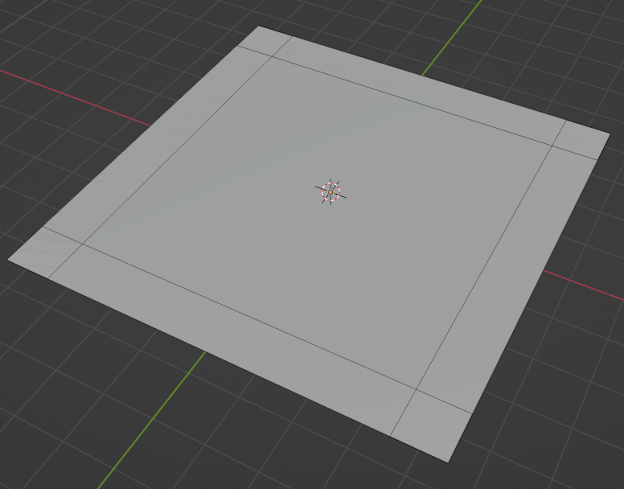
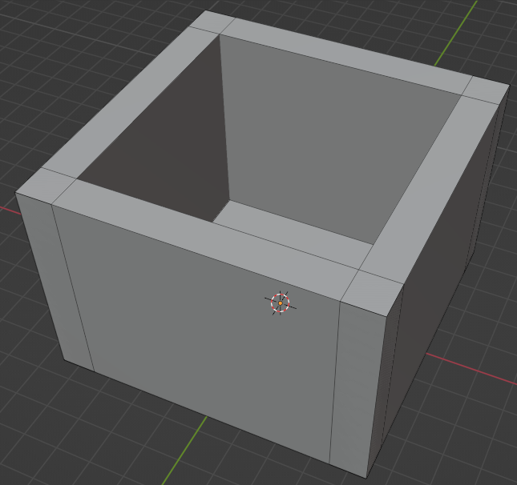

# U.T. 1 Introducción
## Ejercicio
>1.- Crear una nueva escena general 
2.- Borra el cubo actual 
3.- Agregar un plano de 0.9 
4.- Cambiar al modo edición (**TAB**) selección de aristas (**2**) 
5.- Seleccionar una aristar, extruirla según el eje plano perpendi cualar 0.1 
6.- Repetir con las otras tres aristas:  
7.- Seleccionar las 4 caras recién creadas y extruirlas según el eje Z 0.6:  
8.- Cambiar al modo objeto **TAB** 
9.- Agregar un nuevo plano y posicionarlo en 0.6 del eje Z 
10.- Cambiar al modo edición **TAB** y extruirlo según el eje Z 0.1 
11.- Cambiar al modo objeto **TAB** 
12.- Usar los diferentes modos de visualización:  
13.- Seleccionar la tapa y cambiar a la pestaña de materiales: 
 
14.- Pulsar en Nuevo. 
15.- Quitar **Usar Nodos** y cambiar el color de base 
16.- Repetir para la base a otro color, se puede usar la pestaña de Material Library VX -> Applay to Selected. 
17.- Desplazar la tapa 0.05 en el eje Z, en el eje X -.15 y .15 en el eje Y 
18.- Pulsar F12

No es muy impresionante, pero es nuestro primer modelo, a continuación los ejemplos que hay que entregar

## Ejercicio entregar 1

## Ejercicio entregar 2

## Ejercicio entregar 3
