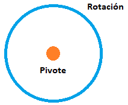

# U.T. 2 Primeros pasos con Blender
## Introducción al modelado
### Nombrado de objetos

Mantener organizado nuestro proyecto a través de las colecciones y mediante un buen nombrado es indispensable en todos los trabajos. El panel nos proporciona un mecanismo sencillo de gestión, simplemente dando doble clic sobre el nombre a cambiar se habilita el cambio, terminado dicha modificación al pulsar ENTER.

Es muy importante seguir un esquema de nombrado desde el principio del proyecto. Sugiero que se usen un esquema con varias palabras separadas por una barra baja o un punto cuando sea necesario y que los nombres de los componentes sean descriptivos, no como aparece en la imagen de cabecera.

>**Nombrado** 
*mat.suelo.gris*, para un material por ejemplo. 
*suelo*, para un componente.  
*silla.cabecera*, etc.

También es imprescindibles que utilicemos las colecciones tal y como se comentó en la unidad anterior. Recordar que se crean con el botón derecho del ratón y se deben nombrar también de forma adecuada. Es muy útil saber que una colección puede tener además de objetos otras colecciones.

### Herramientas
- Uso de la tecla **Mayus+B**. Este atajo nos va a permitir hacer zoom rápido sobre una sección de nuestro proyecto dibujando un recuadro.
- Uso de la vista local (**menú vista->Vista Local -> Alternar vista local**) o tecla **/** del NumPad. Generalmente los proyectos contarán con múltiples objetos en la escena, y trabajar sobre uno de ellos en concreto puede ser muy laborioso. Para permitir aislar el objeto de trabajo, lo seleccionaremos en modo Edición y usaremos esta opción. Una vez hayamos terminado el trabajo sobre el objeto, deberemos de desactivar la vista local para volver a visualizar la escena completamente. 
- Uso de las teclas **B**, **C** y **W** para selecciones. Tanto en modo objeto como edición una tarea fundamental que ya hemos comentado es la selección. Las herramientas de selección se vieron en la unidad pasada, pero ahora vemos los atajos que podemos usar para acelerar el proceso. En concreto **B** permite dibujar un rectángulo de selección, **C** cambia al modo círculo de selección (**para este modo podemos usar la rueda del ratón para cambiar el tamaño del círculo de selección**) y **W** rotará entre todos los modos de selección. En cualquier caso, se usarán con el apoyo de las teclas **CTRL** y **MAYUS** tal y como se indicó anteriormente o haciendo uso de la cinta de botones de selección.
 

## Transformaciones conceptos avanzados
### Punto de pivotaje
Se entiende como el punto de pivotaje el lugar geométrico que se usará para realizar las rotaciones. Este punto puede ser el centro del objeto o cualquier otro que establezcamos. Por defecto se usa el centro del objeto y aparecerá resaltado como un punto naranja en el objeto. 
Es muy importante que este punto esté situado correctamente antes de realizar la rotación ya que determinará cómo se va a realizar.

Con el centro pivotaje en el centro de masas del objeto:
 

Con el centro de pivotaje fuera del objeto:
 

En la primera imagen vemos como se rota el propio cubo tomando como centro el punto resaltado, vemos que gira completamente a través del eje X pero sin desplazarse. Por contra, en la segunda vemos como el cubo se desplaza en la rotación ya que el origen de la misma está fuera de él.

 

Tal y como observamos en la imagen anterior, a la hora de rotar se crea una circunferencia alrededor del objeto que pasa por el eje seleccionado, teniendo esta situado el centro en el punto pivote y la distancia a la misma en el centro del objeto. 

>**Ejercicio** 
1.- Crear una escena nueva.  
2.- Rotar el cubo 45º eje X.  
3.- Cambiar al modo edición.  
4.- Seleccionar todos los vértices.  
5.- Desplazarlos a lo largo del eje X hasta que el pivote coincida con una arista.  
6.- Cambiar al modo edición.  
7.- Rota el objeto.  
8.- Probar con otros cambios de pivote.  

 

Hasta ahora hemos modificado el pivote de forma permanente para realizar nuestros cambios. Podemos modificar temporalmente el centro de modificación de nuestros objetos con el menú anterior. Las opciones presentes son:
- El centro del volumen delimitador, o centro de masas del objeto.
- El cursor 3D. Utilizará la posición actual del cursor 3D, El icono con unos ejes pequeños y un círculo rojo y blanco. Recordar que se puede cambiar con las herramientas laterales su posición.
- El resto de opciones se utilizan cuando hay varios objetos seleccionados a la vez.
  - Orígenes individuales. Hará que se rote cada objeto de forma individual a partir del volumen delimitador.
  - Punto medio. Utilizará el punto medio de todos los objetos seleccionados para realizar la transformación.
  - Elemento activo. Será el elemento marcado en color naranja y su centro el que se usen para la modificación de todo el conjunto.

>**Ejercicio** 
1.- Crear una escena nueva.  
2.- Duplicar el cupo y moverlo por el eje X.  
3.- Seleccionar los dos cubos.  
4.- Utilizar las tres opciones finales para ver cómo rotan los objetos.  
5.- Seleccionar el cubo más alejado en el eje Y.  
6.- Utilizar las dos primeras opciones y rotar para ver el efecto

### Transformaciones globales frente a locales
Cuando realizamos alguna de las transformaciones básicas se elige un conjunto de ejes como referencia para realizar la transformación. Generalmente los ejes que se usan son los globales de la escena, los definidos por las líneas de color rojo, verde y azul en el origen de coordenadas. Esto significa que si desplazamos por el eje X un objeto será esa la dirección que use.

Pero veamos qué pasa cuando el objeto está rotado. Rotemos el cubo 45º en uno de los ejes. Desplacemos el cubo en el eje Z, el desplazamiento es el esperado por el eje global. Desplacemos ahora, pero pulsemos dos veces **Z** en el desplazamiento. Veremos que ahora se realiza con un ángulo con respecto al Z global (Azul) y que la posición ha cambiado.

Expliquemos lo que ha pasado. Al pulsar dos veces **Z** hemos decidido usar ejes locales al objeto, en vez de los ejes globales. Cada objeto tendrá un conjunto de ejes de referencia que dependerán de su orientación con respecto al origen de coordenadas. En el ejemplo, al rotarlo 45º hemos cambiado dicha referencia.

 

En la imagen podemos ver cómo los ejes globales (en color: rojo, verde y azul) no están orientados de la misma forma que los ejes locales (naranja). Como las transformaciones se hacen siempre tomando como referencia unos ejes, vemos que no darán el mismo resultado si usamos los globales (colores RGB) como si usamos los locales (naranja). La elección dependerá de cómo queremos hacer la transformación, recordando que por defecto se usa la referencia global y hay que pulsar dos veces en el nombre del eje para cambiar a la referencia local. También podemos hacer este cambio en la barra de botones superior.

 

### Panel de transformaciones

Cada objeto tiene unas características en cuanto a posición, tamaño, escala y rotación. Estas características las podemos modificar con las operaciones (rotación, desplazamiento, etc.) o estableciendo los valores en el panel de transformaciones. Este panel aparece en la parte derecha del visor 3D (tecla **N** si no está visible) seleccionando la pestaña elemento.
El panel reflejará los datos del objeto seleccionado y cambiando los datos de cualquier eje o propiedad se los estaremos cambiando al objeto.

Una característica del interfaz de Blender que ahora señalamos es la posibilidad de cambiar varios valores de forma simultánea. Se pulsa con el botón izquierdo del ratón en el valor a cambiar y arrastramos hacia abajo, recorriendo los valores que deseamos cambiar parando en el último (se cambia el color de fondo para indicar la selección) a continuación, desplazamos izquierda o derecha y se establecerán de forma simultánea todos los valores.

### Ayudas a las transformaciones

Blender nos facilita nuestro trabajo con numerosas ayudas tales como las teclas o los gizmos. En este caso hablaremos de estos segundos. Los gizmos son representaciones gráficas de los ejes coordenados sobre el objeto que se pueden utilizar para realizar la acción. Además, estos ejes están coloreados de la misma manera que los ejes globales (x en rojo, y en verde y z en azul). Pulsando sobre cualquier eje del gizmo y arrastrando realizaremos la operación deseada en dicho eje. Hay que tener en cuenta que estos gizmos solo aparecen cuando usamos los botones de la barra de herramientas situada en la parte izquierda del visor 3D (tecla **T**).

Por defecto Blender realiza la acción seleccionada en función del desplazamiento del ratón que nosotros hagamos, pero podemos controlar de forma más fina dicho desplazamiento con las teclas **MAYUS**, **CTRL** y **ambas** a la vez pulsadas cuando desplazamos. Así la tecla **MAYUS** nos da un control muy fino del desplazamiento, el incremento es muy pequeño. La tecla **CTRL** obliga a hacer saltos de una unidad al desplazar el ratón y la unión de ambas se queda en un desplazamiento intermedio, en concreto incrementa el primer decimal de la medida en valores de uno.

>**Ejercicio** 
1.- Abrir una escena nueva.  
2.- Seleccionar el cubo.  
3.- Seleccionar la herramienta desplazar en la barra, **NO con la tecla G**.  
4.- Desplazar el objeto a través de los ejes sin usar las teclas de ayuda; usando **MAYUS**; usando **CTRL**; y usando **Ambas**.  

La barra de herramientas presenta las siguientes opciones, excepto escalar las demás opciones son únicas y ya las hemos explicado.

La opción de **escalado en jaula** nos muestra una interfaz diferente para realizar la operación, pero con resultados similares. Se muestra un volumen delimitador de la forma y un conjunto de puntos de escalado. El pivote para la escala será el opuesto al que seleccionemos para arrastrar con el ratón.

En este caso usaremos los puntos para realizar el escalado en vez de gizmos de transformación.

### Otros conceptos
#### Alineación de varios objetos

La alienación de varios objetos se realiza a través del menú que vemos en la primera imagen de este apartado, una vez seleccionados uno o varios objetos. Tras la operación, en la parte inferior izquierda, podemos configurar la alineación a nuestro gusto: seleccionando qué elemento se tomará como origen de la alineación en cada objeto (Modo de alineación); qué elemento se tomará como referencia para alinear todos los objetos (Relativo a) y por último los ejes en los que queremos alinear, pudiendo usar la tecla **ALT** para seleccionar más de un eje.

#### Uso de unidades de medidas
Hasta ahora hemos utilizado el teclado y el ratón para realizar las transformaciones, pero este tipo de organización no es muy adecuada si lo que necesitamos son valores exactos, como por ejemplo en planos. Para este caso podemos usar medidas y valores exactos de la siguiente manera: Seleccionamos la Operación, seleccionamos el eje (una o dos veces según global o local) y por último tecleamos el valor numérico que deseamos (incluso con decimales, usando el punto).

>**Ejemplo:** GZ0.5

Las unidades se configuran para cada escena dentro de sus propiedades en el visor correspondiente (ver imagen anterior). Podemos establecer unidades métricas (metros, decímetros, etc.); unidades imperiales (pies, pulgadas, etc.) o unidades Blender (ninguna) en cualquier caso, siempre que tecleemos un valor en una unidad tomará por defecto la unidad por referencia (el metro en sistema Métrico) del sistema, pero podemos añadir a dicho valor un sufijo de unidad (en las cajas de texto) para cambiarla y que la utilice Blender (45cm para 45 centímetros, etc.).

#### Uso de la herramienta de medida para longitudes y ángulos

Para terminar esta parte hablaremos de la herramienta de medida, herramienta que permite determinar la longitud entre dos puntos y el ángulo entre ambos. Una vez seleccionada la herramienta se pulsa en el primer punto a medir (se puede usar adherir), arrastramos y soltamos en el segundo punto a medir (mostrará la distancia) y si deseamos medir el ángulo, pulsamos en medio el tercer punto que generará el vértice del ángulo y lo arrastramos.

Para eliminar una medición se selecciona y se borra con la tecla **X**.

---
[Siguiente](ut_2_02.md)
