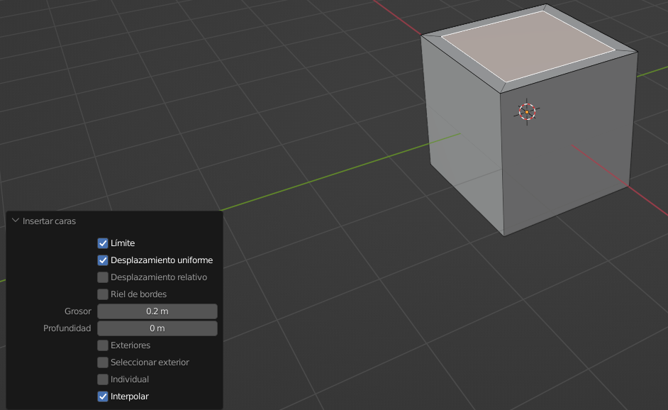
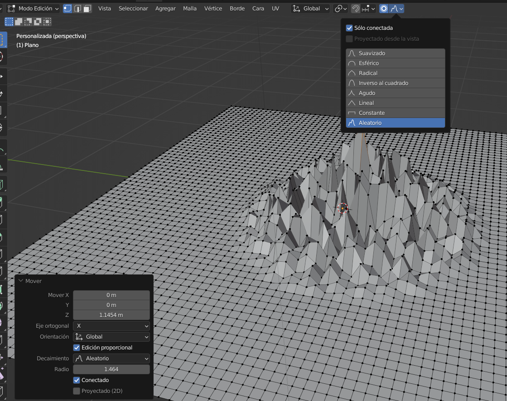
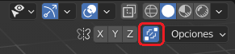
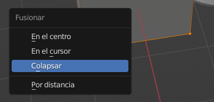
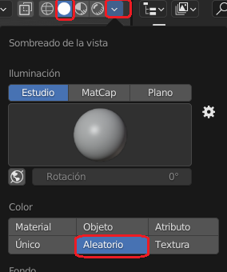
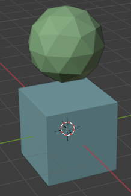
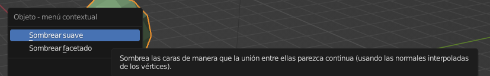
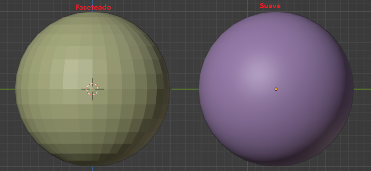
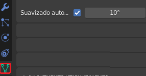

# U.T. 2 Primeros pasos con Blender
- [U.T. 2 Primeros pasos con Blender](#ut-2-primeros-pasos-con-blender)
  - [Edición de objetos](#edición-de-objetos)
    - [Introducción](#introducción)
    - [Subdivisión de elementos](#subdivisión-de-elementos)
    - [Creación de nuevas caras](#creación-de-nuevas-caras)
      - [Inserción de nuevas caras](#inserción-de-nuevas-caras)
      - [Fusión](#fusión)
    - [Edición proporcional](#edición-proporcional)
    - [Uso del panel última operación (Tecla F9)](#uso-del-panel-última-operación-tecla-f9)
    - [División de partes de objetos (tecla P)](#división-de-partes-de-objetos-tecla-p)
    - [Unión de objetos](#unión-de-objetos)
      - [Unión de vértices](#unión-de-vértices)
    - [Ocultación de objetos](#ocultación-de-objetos)
    - [Coloreado de objetos para una mejor visión](#coloreado-de-objetos-para-una-mejor-visión)
    - [Suavizado de objetos para el renderizado](#suavizado-de-objetos-para-el-renderizado)

## Edición de objetos
### Introducción
Generalmente una vez que tenemos una primitiva insertada en nuestra escena raramente se va a ajustar a nuestras necesidades. Deberemos realizar algún tipo de modificación de sus elementos para llegar al modelado deseado.

En este apartado y en los siguientes vamos a conocer las herramientas más relevantes para hacer de forma eficiente estas transformaciones.

### Subdivisión de elementos
Al añadir una primitiva determinamos el número de elementos por la que está formado, pero la densidad que vamos a necesitar variará en función del modelo y las partes de este. Es crucial tener una malla con suficiente detalle para que el modelo sea realista, con lo que es muy normal añadir caras a partes de la primitiva una vez en la escena.

>**Ejemplo: ** 
1.- Crear una escena nueva.  
2.- Cambiar al modo edición y seleccionar una cara.  
3.- Abrir el menú contextual y seleccionar **subdividir**.  
4.- Cambiar las propiedades en el panel inferior izquierdo.  

En este ejemplo se han creado 10 cortes y vemos como la cara seleccionada tiene ahora 100 caras en vez de una. El máximo de cortes por operación es 10 pero nada impide que realicemos la operación múltiples veces, teniendo en cuenta que no siempre cuanto más caras es mejor, tiene que estar acorde al modelo a realizar.

Además de establecer el número de cortes, se puede determinar si se van a suavizar las caras (redondear) o si se va a añadir aleatoriedad a la posición de las mismas (fractal), opción muy útil para terrenos. También es importante determinar el tipo de esquina a usar en la división.

Nada nos impide realizar esta operación a todos los elementos a la vez o a un conjunto de varios seleccionados, pero las divisiones más eficientes se hacen sobre una única cara o todo el objeto.

>**Ejercicio** 
1.- Realizar el siguiente ejemplo. Ten en cuenta que no hay huecos y que se deben rellenar con la opción **F** del siguiente punto.

### Creación de nuevas caras
Otro mecanismo muy común a la hora de modificar la malla es insertar nuevas caras dentro de una ya existente o a partir de varios vértices.

#### Inserción de nuevas caras
Para crear una nueva cara su usa la tecla **I** en el modo Edición con al menos una cara seleccionada. Es recomendable tener alejado el cursor del centro de la cara ya que, una vez iniciada la operación, aparecerá una línea que desplazaremos hacia el centro para definir el tamaño de la cara.

Desplegando el panel inferior podemos determinar algunas características más sobre la inserción: La profundidad de la cara nos permitirá desplazarla en el eje Z a la vez que la creamos y algunas más que podemos investigar.

#### Fusión
Si con la tecla I creamos nuevas caras, ahora las crearemos a partir de los vértices que tengamos seleccionadas, rellenándolas. Para este fin tenemos tres opciones:
- Mediante la tecla **F**. Esta forma, tras seleccionar al menos tres vértices crea una cara con ellos. Este acelerador lo que hace realmente es fusionar, no rellenar, con lo que si tenemos varias caras seleccionadas también intentará crear una sola.
- Mediante las teclas **ALT+F**. Con este mecanismo es necesario tener al menos cuatro vértices para crear la cara y utilizará triángulos en vez de cuadriláteros.
- Mediante las teclas **CTRL+F->Rellenar cuadrícula**. Permite crear una cara y dividirla a su vez en un grid en vez de tener una única cara.
>Es interesante conocer el menú que aparece con **CTRL+F**.

>**Ejemplo** 
1.- Crear una nueva escena.  
2.- Seleccionar una cara y borrarla.  
3.- Seleccionar todos los bordes de la cara borrada y subdividirlos en 5.  
4.- Seleccionar todos los nuevos bordes creados.  
5.- Pulsar **CTRL+F->Rellenar cuadrícula**.  
6.- Modificar los parámetros de la ventana inferior izquierda, en concreto el **alcance** y probar con seis y valores distintos. Cambiar también el **desplazamiento**.   

### Edición proporcional
La edición proporcional se usa para extender las modificaciones que realizamos a más elementos que el seleccionado, para entenderlo mejor crearemos un ejemplo.

>**Ejemplo**  
1.- Crear una escena nueva, borrar el cubo y añadir un plano.  
2.- Subdividir el plano hasta que tenga 100 caras.  
3.- Escalarlo hasta tres veces el tamaño inicial.  
4.- Seleccionar un vértice del plano.  
5.- Seleccionar la herramienta de edición proporcional en la barra superior (ver imagen posterior).  
6.- Desplazar en el eje Z el vértice pulsando **G**.  
7.- Mover la rueda del ratón para variar el tamaño del círculo que aparece.

Como hemos visto podemos realizar operaciones que se extiendan alrededor del objeto seleccionado (en el ejemplo el vértice) determinando la extensión a la que va a afectar (Círculo) y la forma que tendrá (Suavizado, esférico, etc.). Una vez terminada la operación podemos cambiar los parámetros de la misma en la ventana inferior izquierda (Decaimiento o forma y radio o área de influencia).

En concreto la forma aleatoria permite crear paisajes montañosos muy rápidamente. **Es recomendable hacer pruebas con todos los tipos y familiarizarse con este mecanismo**.

### Uso del panel última operación (Tecla F9)
Hemos visto ya que después de realizar una operación aparece en la parte inferior izquierda un panel en el que se puede modificar dicha acción. Este panel se llama de última operación y puede estar abierto o contraído, en este último caso se puede abrir pulsando sobre el nombre que se visualiza.

El panel permite ajustar todos los parámetros de la última operación que hemos hecho, pero desaparece al pulsar con el ratón en cualquier otro elemento del interfaz o al dar por terminada la operación con el **ENTER**. En caso de necesitar este panel y no estar visible, se puede usar la tecla **F9** para hacer que aparezca.

>Ver la imagen anterior el panel *mover* en la parte inferior izquierda.

### División de partes de objetos (tecla P)
El modelado de una escena u objeto suele ser complejo y tener muchos elementos diferenciados. Generalmente crearemos una malla que iremos refinando hasta conseguir el objeto. A veces, nos encontraremos en situaciones en la que, tras modelar el objeto, este tiene varias partes y nos interesa que sean dos diferentes. En este caso podremos separar una de las partes de la otra, creando dos objetos diferentes, mediante la tecla **P**.

El procedimiento es sencillo, se seleccionan todos los elementos que van a formar parte del nuevo objeto, se pulsa la tecla y automáticamente se crea un nuevo objeto nombrado como el original, pero añadiendo uno.

>**Ejemplo** 
1.- Crear una nueva escena.  
2.- Cambiar al modo edición.  
3.- Añadir una rosca a la escena y desplazarlo, pero sin dejar de tocarse.  
4.- Seleccionar la mitad del cubo y del toroide que están juntas.  
5.- Pulsar **P->Selección**.  
6.- Cambiar al modo objeto y comprobar que son dos diferentes.  

Si hemos seguido el proceso anterior de forma correcta, nos abrá aparecido un menú tras pulsar la **P** en el que hay varias opciones. En este caso son interesantes **selección** y **material**. La primera divide según la selección que tengamos hecha, la segunda en función del material asignado a cada parte del objeto.

### Unión de objetos
al igual que tendremos situaciones en la que deseamos dividir nuestro objeto en parte, también querremos unir dos objetos como si fueran uno. En este caso, se deben seleccionar todos los objetos a unir y pulsar la combinación **CTRL+J**. Automáticamente unirá todos los objetos en uno.

>**Ejemplo:**  
1.- En el ejemplo anterior, seleccionar ambos objetos y unirlos.

#### Unión de vértices
Cuando operamos con nuestra malla es muy posible que creemos o movamos vértices que estén muy cerca y que sean innecesarios. Es un problema muy grave este tipo de situaciones ya que nos llevarán a fallos en el renderizado posterior. Para minimizar estos fallos podemos utilizar las siguientes opciones que nos unirán varios vértices:

- Unión automática. En la barra del visor 3D aparece el botón de unión automática de vértices, que si está seleccionado nos fusionará dos vértices que estén en la misma posición sin que hagamos nada. Generalmente es un funcionamiento que nos interesa tener activado, pero habrá situaciones en las que necesitemos ambos vértices.

- Uso de la tecla **M** para unir vértices. Con varios vértices seleccionados aparece un menú de fusión. Seleccionando la opción que sea más adecuada hará que de todos quede un único vértice modificando la malla. La opción por distancia nos permitirá establecer la distancia mínima entre dos vértices para ser fusionados en uno.

- **Menú contextual->Disolver**. En este caso, no se unirán todos los vértices en uno, se eliminarán, pero intentando fusionar los vértices y caras que quedan.

### Ocultación de objetos
Trabajar con muchos elementos a la vez puede ser engorroso, para ello podremos ocultarlos a la vista y volver a visualizarlos cuando lo necesitemos de nuevo. La primera opción es a través del visor de objetos situado en la parte derecha tal y como se explicó anteriormente, pero podemos usar atajos de teclado para aumentar nuestra productividad.
- Tecla **H**. Oculta el/los objeto/s seleccionado/s a nuestra vista.
- Teclas **ALT+H**. Muestra todos los objetos.
- Teclas **MAYUS+H**. Ocultar los objetos no seleccionados.

### Coloreado de objetos para una mejor visión

La visualización de una escena suele mejorar si podemos distinguir entre las diferentes partes de este. Como no hemos estudiado todavía materiales, vamos a obligar al sistema a que visualice cada objeto con un color diferente mejorando nuestra percepción. Para establecer la propiedad nos iremos a la barra de menú y con la selección que vemos en la imagen de cabecera podremos acceder al menú de configuración que despliega la flecha. En el menú seleccionaremos dentro de Color la opción **Aleatorio** para que sea Blender el que determine el color de visualización de cada objeto, tal y como se aprecia en la siguiente figura. Cuando veamos materiales, esta opción deberá establecerse a la primera: **Material**.

### Suavizado de objetos para el renderizado
Para terminar esta sección veremos la forma de suavizar las aristas de nuestros modelos de forma rápida sin tener que complicarnos mucho la vida. 

Con el objeto seleccionado, en el menú contextual, seleccionamos **Sombreado -> Suave** para difuminar las uniones o **Sombreado -> Faceteado** para evitar estarlo, modo por defecto.

En caso que el suavizado sea muy elevado, podemos controlarlo a través de las propiedades del objeto, estableciendo el ángulo entre dos caras mínimo a partir del cual se suavizará su arista común.

---
[Siguiente](ut_2_03.md)
