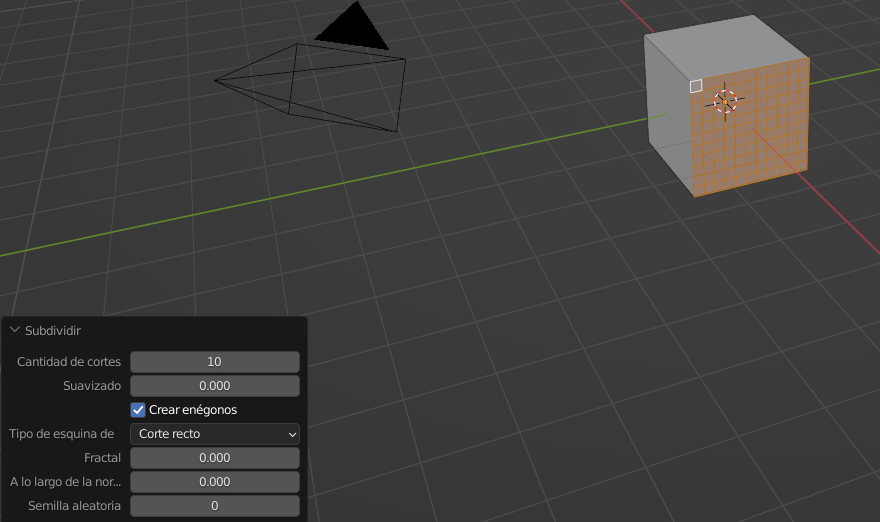
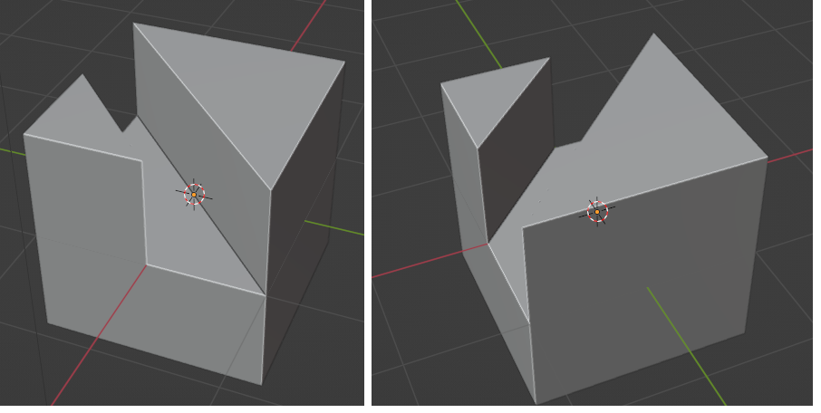

# U.T. 2 Primeros pasos con Blender
- [U.T. 2 Primeros pasos con Blender](#ut-2-primeros-pasos-con-blender)
  - [Edición de objetos](#edición-de-objetos)
    - [Introducción](#introducción)
    - [Subdivisión de elementos](#subdivisión-de-elementos)
    - [Creación de nuevas caras](#creación-de-nuevas-caras)
    - [Edición proporcional](#edición-proporcional)
    - [Uso del panel última operación (Tecla F9)](#uso-del-panel-última-operación-tecla-f9)
    - [Unión de objetos Ctrl+J](#unión-de-objetos-ctrlj)
    - [División de partes de objetos P](#división-de-partes-de-objetos-p)
    - [Ocultación de objetos: H, Mayus+H y Alt+H](#ocultación-de-objetos-h-mayush-y-alth)
    - [Coloreado de objetos para una mejor visión](#coloreado-de-objetos-para-una-mejor-visión)
    - [Suavizado de objetos para el renderizado](#suavizado-de-objetos-para-el-renderizado)

## Edición de objetos
### Introducción
Generalmente una vez que tenemos una primitiva insertada en nuestra escena raramente se va a ajustar a nuestras necesidades. Deberemos realizar algún tipo de modificación de sus elementos para llegar al modelado deseado.

En este apartado y en los siguientes vamos a conocer las herramientas más relevantes para hacer de forma eficiente estas transformaciones.

### Subdivisión de elementos
Al añadir una primitiva determinamos el número de elementos por la que está formado, pero la densidad que vamos a necesitar variará en función del modelo y las partes de este. Es crucial tener una malla con suficiente detalle para que el modelo sea realista, con lo que es muy normal añadir caras a partes de la primitiva una vez en la escena.

>**Ejemplo:** 
1.- Crear una escena nueva.  
2.- Cambiar al modo edición y seleccionar una cara.  
3.- Abrir el menú contextual y seleccionar **subdivir**.  
4.- Cambiar las propiedades en el panel inferior izquierdo.  

Ene este ejemplo se han creado 10 cortes y vemos como la cara seleccionada tiene ahora 100 caras en vez de una. El máximo de cortes por operación es 10 pero nada impide que realicemos la operación múltiples veces, teniendo en cuenta que no siempre cuanto más caras es mejor, tiene que estar acorde al modelo a realizar.

Además de establecer el número de cortes, se puede determinar si se van a suavizar las caras (redondear) o si se va ha añadir aletoriedad a la posición de las mismas (fractal), opción muy útil para terrenos. También es importante determinar el tipo de esquina a usar en la división.

Nada nos impide realizar esta operación a todos los elementos a la vez o a un conjunto de varios seleccionados pero las divisiones más eficientes se hacen sobre una única cara o todo el objeto.

>**Ejercicio** 
1.- Realizar el siguiente ejemplo. Ten en cuenta que no hay huecos y que se deben rellenar con la opción **F** del siguiente punto.

### Creación de nuevas caras
- Con I
- Mediante Fusión con F
- Mediante Alt+F
- Rellenar con Grid Ctrl+F
### Edición proporcional
La edición proporcional se usa para esxtender las modificaciones que realizamos a más elementos que el seleccionado, determinando cómo se hará dicha operación.

- Tipos
- Cambio del área de influencia
### Uso del panel última operación (Tecla F9)
### Unión de objetos Ctrl+J
- Uso de Alt M para unir vértices
- Uso de M para unir vértices
- Unión automática
- W unir cercanos según distnacua
- Página 360 del libro trciks
### División de partes de objetos P
### Ocultación de objetos: H, Mayus+H y Alt+H
### Coloreado de objetos para una mejor visión
### Suavizado de objetos para el renderizado

---
[Siguiente](ut_2_03.md)
