# U.T. 2 Primeros pasos con Blender
- [U.T. 2 Primeros pasos con Blender](#ut-2-primeros-pasos-con-blender)
  - [Herramientas de edición](#herramientas-de-edición)
    - [La barra de herramientas](#la-barra-de-herramientas)
    - [Recordando las herramientas que ya hemos aprendido](#recordando-las-herramientas-que-ya-hemos-aprendido)
    - [Herramienta Biselar](#herramienta-biselar)
    - [Herramienta Cortar bucle](#herramienta-cortar-bucle)
    - [Cortar](#cortar)
    - [Crear Polígono](#crear-polígono)
    - [Girar](#girar)
    - [Suavizar y aleatorizar](#suavizar-y-aleatorizar)
    - [Deslizar bordes y vértices](#deslizar-bordes-y-vértices)
    - [Contraer / Expandir](#contraer--expandir)
    - [Inclinar/Esferizar](#inclinaresferizar)
    - [Arrancar región](#arrancar-región)
## Herramientas de edición
### La barra de herramientas
La modificación de un objeto nos llevará gran parte de nuestro tiempo, conocer todas las herramientas disponibles y aprender a utilizar la adecuada es imprescindible si queremos desarrollar un buen diseño.

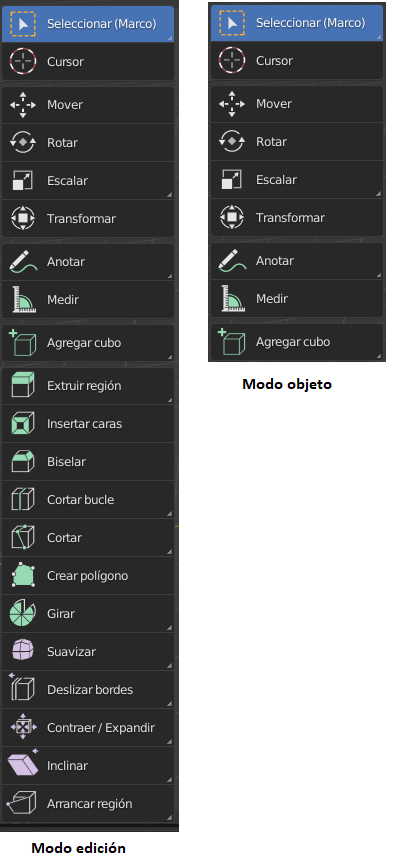

En el visor, la barra de herramientas aparece en la parte izquierda y podemos ocultarla para dejar más espacio a través de la tecla **T**. Es posible cambiar el tamaño de la misma arrastrando desde el borde derecho de la misma.

Esta barra de herramientas tendrá todas las operaciones posibles dependiendo del modo de edición en el que nos encontremos. Las herramientas presentes en el modo objeto son un subconjunto de las que existen en el modo edición por lo que centraremos la explicación en dicho modo.

### Recordando las herramientas que ya hemos aprendido
Algunas de las herramientas presentes ya las hemos estudio y no las vamos a repetir, deberemos repasar los conceptos de dichas herramientas y tenerlos bien aprendidos antes de continuar. En concreto hemos visto ya:
- Herramientas básicas: Seleccionar, Mover, Rotar, Escalar, Transformar y Medir.
- Establecer el Cursor del mundo.
- Menú para añadir objetos.
- Extrusión.
  - Caras.
  - Vértices.
  - Aristas.
  - Visualización del menú contextual de extrusión con las teclas **ALT+E**.
- Insertar caras.
- Fusionar caras.
### Herramienta Biselar
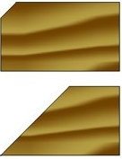

Biselar es hacer un corte oblicuo en el borde o en extremo de un objeto. Al utilizar esta herramienta con una cara seleccionada, sus bordes cambiarán de forma creando una unión entre las aristas más suaves.

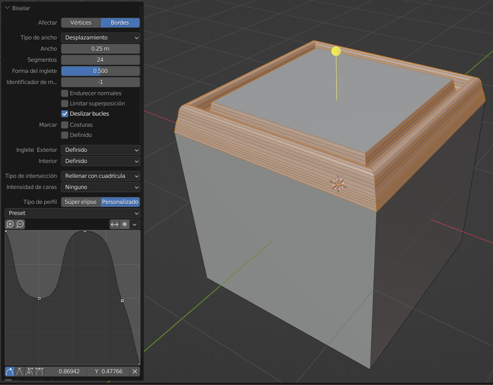

Esta herramienta en su versión más sencilla nos permite crear bordes redondeados o vértices estableciendo el parámetro **Afectar**. También determinamos la forma en la que se van utilizar los parámetros con **Tipo de Ancho**. Lo mejor en este caso es seleccionar una cara, crear un biselado y con la pantalla de última operación (**F9**) ir probando los parámetros.
- Los valores de Ancho y segmentos determinan hasta dónde afecta el biselado y en número de nuevas caras que se van a crear.
- El parámetro forma determinará la esfericidad del borde, siempre que el tipo de perfil sea Súper elipse, en caso que sea personalizado no tendrá efecto. Permite crear bordes cóncavos, convexos o planos.
- El tipo de perfil nos permite determinar la forma del borde a nuestro gusto, con puntos y una gráfica tal y como se ve en el ejemplo.

>Para más información visitar: [Bisel - manual de Blender](https://docs.blender.org/manual/es/3.2/modeling/meshes/editing/edge/bevel.html)

### Herramienta Cortar bucle
Hemos comentado múltiples veces que tendremos que modificar nuestra malla para tener una mayor resolución y adaptarse al modelo que deseamos crear. En este caso dividiremos un objeto haciendo un corte sobre la superficie bien en dirección horizontal o vertical, creando nuevas aristas.

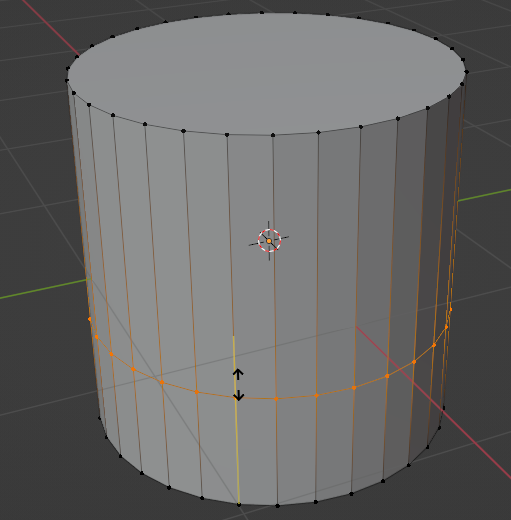

El procedimiento es sencillo, una vez seleccionada la herramienta nos posicionamos en la parte del objeto a cortar, aparecerá una guía de color amarilla indicando el corte que se va a efectuar, en caso de pulsar el botón izquierdo se realizará el corte, y sin soltar dicho botón podremos arrastrar el corte para situarlo en la posición deseada.

A través del panel, controlamos aspectos del corte, como el número de cortes, el desplazamiento de los mismos.

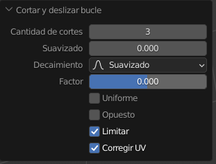

Podemos usar la herramienta **cortar y desplazar bucle de bordes** que aparece al pulsar sobre el triángulo inferior derecho del icono de la herramienta de cortar. Esta opción con un borde seleccionado nos creará dos cortes simétricos al seleccionado (para ver un efecto recomiendo seleccionar una arista vertical del cilindro y probar la herramienta).

### Cortar
Esta herramienta permite realizar cortes a mano alzada sobre el modelo. Pulsando en un punto con el ratón y arrastrando se va dibujando el polígono que servirá de base para el corte. Una vez finalizado el corte se pulsa **ENTER** para que se complete.

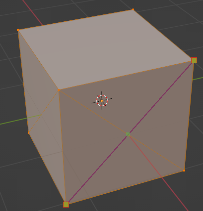

### Crear Polígono
Nos permite crear nuevas caras a partir de una arista. Con la herramienta activa veremos que se marcan en azul aristas o vértices. En caso de ser arista, si arrastramos con el ratón se creará una nueva cara a partir de ella, si es un vértice se desplazará.

### Girar
Esta herramienta nos girará los elementos seleccionados tomando como eje el cursor del mundo por defecto, determinando el número de veces a repetir cada objeto y los grados que separaran cada objeto entre sí.

Podemos establecer de forma fácil el eje de rotación y el número de elementos a repetir en la parte superior izquierda de la barra de herramientas. Con estos datos fijos, aparece un gizmo de rotación que nos permitirá determinar el ángulo.

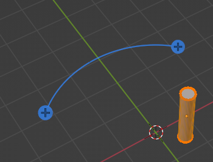

Por último, el panel de operación nos permite configurar de forma más detallada la operación

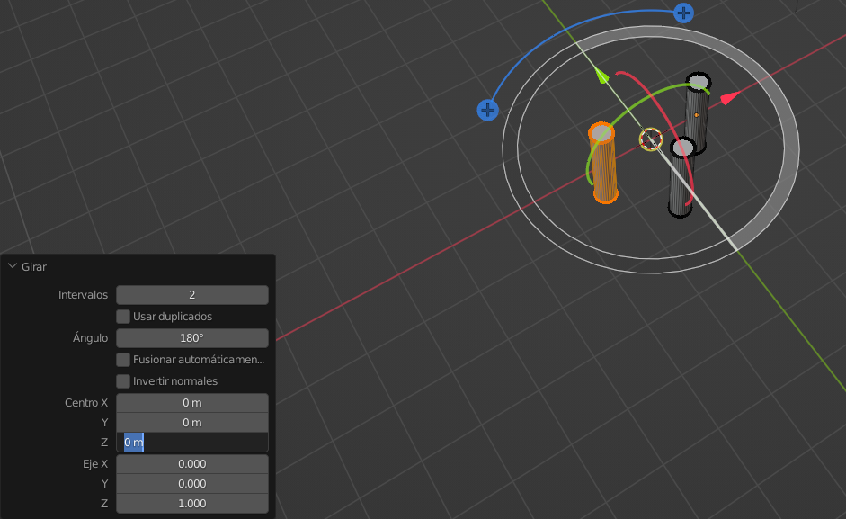

- Intervalos: Número de objetos a crear.
- Ángulo. Ángulo total a usar para los elementos.
- Centro. Coordenadas del centro de la circunferencia de creación.
- Eje. Rotación con respecto a los ejes del plano de creación.

En el ejemplo hemos visto la selección del objeto completo, pero nada nos impide rotar un único elemento o un conjunto de ellos.

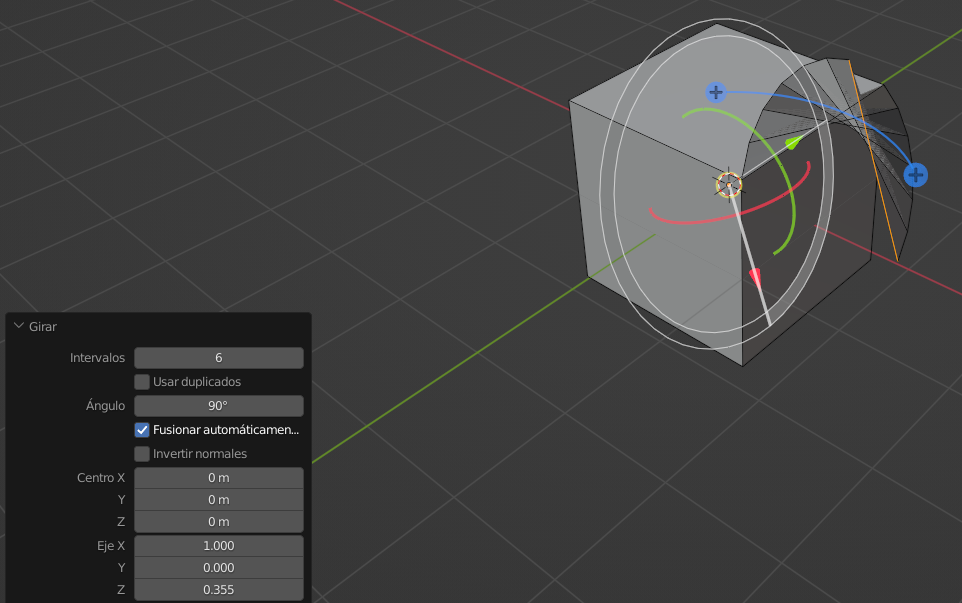

Rotación de una única arista.

### Suavizar y aleatorizar
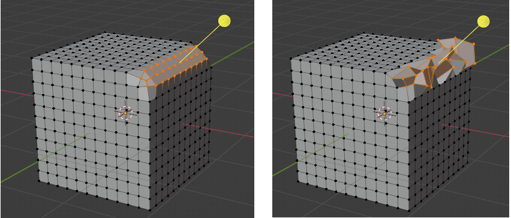

Podemos hacer que las transiciones entre los bordes sean más suevas con **suavizar** o que se hagan de forma aleatoria, tal y como se presenta en la imagen anterior o siguiente. De ambas herramientas, la primera nos permite dar un aspecto más redondeado a nuestros objetos.

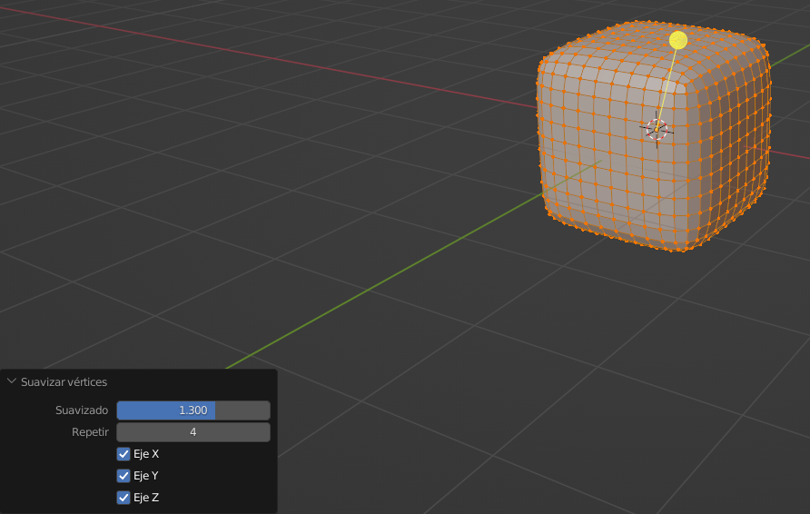

### Deslizar bordes y vértices
Podemos desplazar un vértice o borde a otra posición fácilmente con esta herramienta.

### Contraer / Expandir
Permite cambiar la posición de los elementos seleccionados según su normal y modificar el tamaño a la vez.

>Visitar [Manual Blender](https://docs.blender.org/manual/es/3.2/modeling/meshes/editing/mesh/transform/shrink-fatten.html)

### Inclinar/Esferizar
Modifica la geometría del objeto inclinando o redondeándolo.

>Visitar [Inclinar - Manual Blender](https://docs.blender.org/manual/es/3.2/modeling/meshes/editing/mesh/transform/shear.html)

>Visitar [Esferizar - Manual Blender](https://docs.blender.org/manual/es/3.2/modeling/meshes/editing/mesh/transform/to_sphere.html)

### Arrancar región
Esta herramienta permite separar los elementos seleccionados de las uniones que tengan. Se visualiza muy bien seleccionando una arista y utilizando la herramienta, veremos como la arista se puede desplazar sin arrastrar sus antiguas uniones creando huecos.

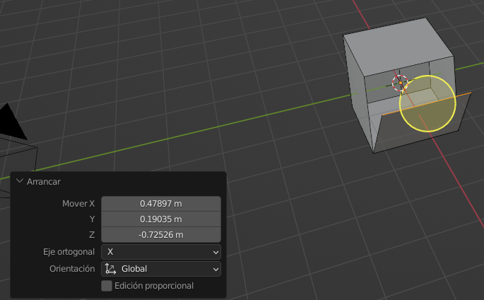

---
[Siguiente](ut_2_04.md)
