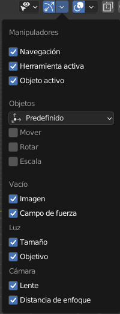

# U.T. 2 Primeros pasos con Blender
- [U.T. 2 Primeros pasos con Blender](#ut-2-primeros-pasos-con-blender)
  - [Ayudas del Visor 3D - Barra de Herramientas](#ayudas-del-visor-3d---barra-de-herramientas)
    - [Selección de ejes](#selección-de-ejes)
    - [Pivote de transformaciones](#pivote-de-transformaciones)
    - [Adherir las operaciones](#adherir-las-operaciones)
    - [Transformación proporcional](#transformación-proporcional)
    - [Selección de elementos a visionar](#selección-de-elementos-a-visionar)
    - [Gizmos](#gizmos)
    - [Overlays](#overlays)
    - [Rayos X](#rayos-x)
    - [Sombreado](#sombreado)
      - [Tipos de sombreadores](#tipos-de-sombreadores)
      - [Uso de GPU](#uso-de-gpu)
## Ayudas del Visor 3D - Barra de Herramientas
La barra de herramientas nos presenta opciones a configurar de forma rápida.

### Selección de ejes

Determina el eje que afectará a las transformaciones.

### Pivote de transformaciones

Establece el punto de referencia para las transformaciones.

### Adherir las operaciones

Permite fijar los elementos durante las transformaciones a otros elementos.

### Transformación proporcional

Aplica la transformación a más elementos que el seleccionado.

### Selección de elementos a visionar

Precisa los elementos que se podrán visualizar.

### Gizmos

Fija las ayudas al diseño que se mostrarán.

### Overlays

Muestra información sobreimpresa en el visor 3D de ayuda.

### Rayos X

Facilita la selección de los elementos que están ocultos detrás.

### Sombreado

Determina cómo se va a visualizar la escena dentro del programa, no tiene nada que ver con el hecho que se genere una imagen final o un video. De izquierda a derecha:
- Modo Alambre. Muestra el objeto con solo sus aristas, las caras no serán visibles.
- Modo Sólido. Se muestra el objeto completo, las partes ocultas no se verán a menos que establezcamos el modo rayos X.
- Modo Previsualización de materiales. Al utilizar materiales, previsualizará el objeto, con una iluminación tipo, sin tener en cuenta la que hayamos creado.
- Modo Procesado. Visualizará el objeto similar al producto final, pero con una calidad menor.

Todos los modos tienen propiedades que podemos cambiar a través de la flecha que aparece a la derecha de los cuatro iconos.

**Opciones para el modo sólido**. Podemos cambiar la iluminación por defecto pulsando en la esfera, así como algunos parámetros interesantes como el color o el fondo.

En el **modo Previsualización** las opciones son menores, además del cambio de iluminación global que se puede establecer al pulsar en la esfera, cambiamos la rotación y la intensidad de la misma.

#### Tipos de sombreadores

El motor de renderizado es el encargado de visualizar el objeto actual en la pantalla a la hora de trabajar y de crear la escena final. Existen tres motores diferentes en Blender por defecto: Eevee, Workbench y Cycles. Eveen genera resultados más rápidos que Cycles, pero menos realistas, y el procesado de los reflejos es más difícil. En mi caso, trabajo con Eevee y paso a Cycles para los pasos finales de renderizado. En caso que no se tenga una tarjeta gráfica potente es mejor trabajar solo con Eevee.

Cada motor tiene sus propios parámetros, que podemos visualizar en el panel izquierdo. Lo que es común, es el hecho que podemos establecer calidades diferentes para el modo de trabajo y el modo final de renderizado, mejorando la eficiencia de ambos motores y el flujo de trabajo en general a costa de una menor calidad.

#### Uso de GPU
No hemos hablado hasta ahora de la necesidad de una tarjeta gráfica potente en ningún momento, pero cuando los proyectos se compliquen o sean muy numerosos los objetos en la escena será de una ayuda indiscutible contar con ella. En este caso tenemos que configurar dos partes en nuestra aplicación para que todo sea correcto.
- El motor se configura en las propiedades, en caso que sea Cycles y en el parámetro **dispositivo** estableceremos GPU.
- La aplicación. Si la tarjeta soporta OptiX o HIP sería la opción a usar, en caso de duda o de problemas de estabilidad estableceremos a CUDA.

---
[Siguiente](ut_2_05.md)
