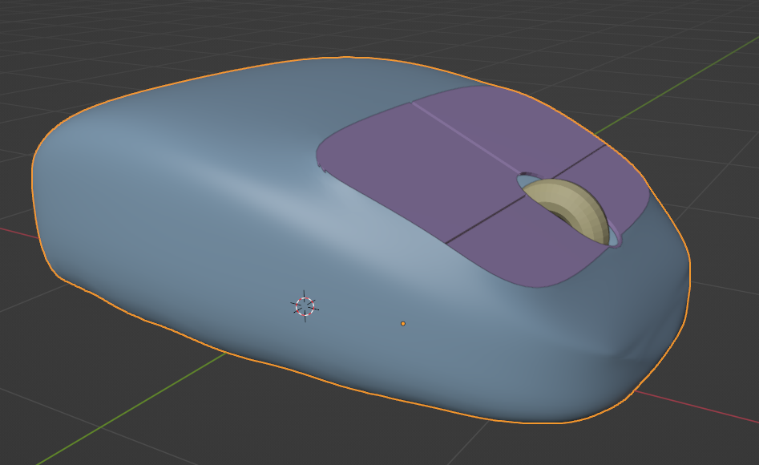
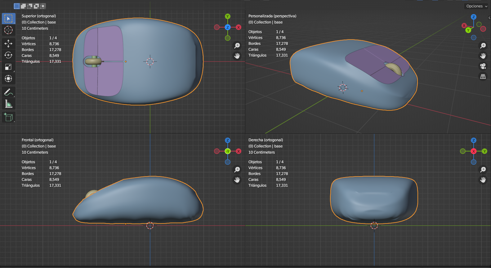
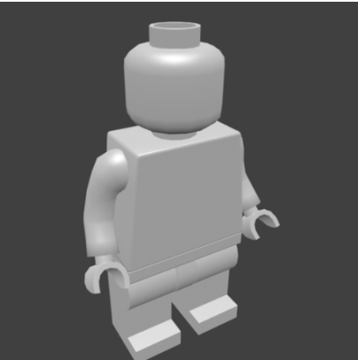

# U.T. 2 Primeros pasos con Blender
- [U.T. 2 Primeros pasos con Blender](#ut-2-primeros-pasos-con-blender)
  - [Ejercicio](#ejercicio)
  - [Ejercicio a entregar 1](#ejercicio-a-entregar-1)
  - [Ejercicio a entregar 2](#ejercicio-a-entregar-2)
## Ejercicio

**Ver src/005.blend**

## Ejercicio a entregar 1

## Ejercicio a entregar 2

