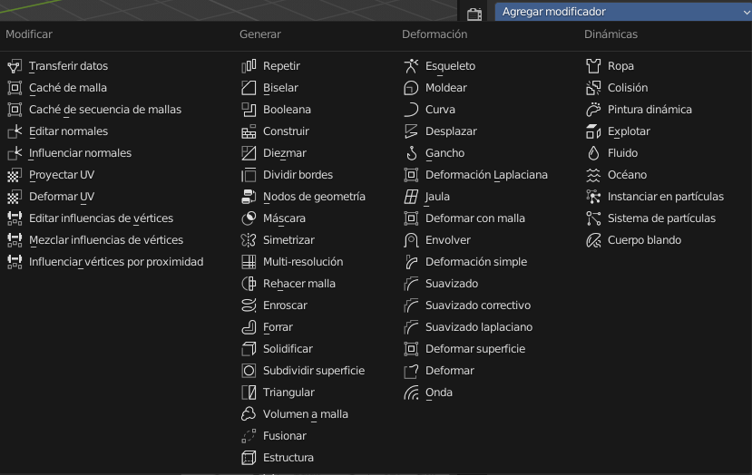
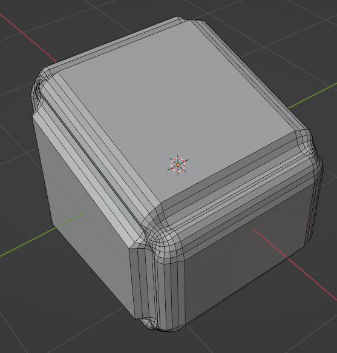
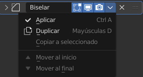
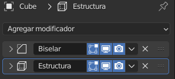
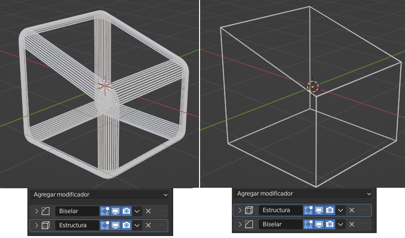

# U.T. 3 Modificadores
- [U.T. 3 Modificadores](#ut-3-modificadores)
  - [Introducción](#introducción)
  - [Categorías](#categorías)
    - [Modificar](#modificar)
    - [Generar](#generar)
    - [Deformar](#deformar)
    - [Dinámicas](#dinámicas)
  - [Ejmplo de uso](#ejmplo-de-uso)
  - [Propiedades comunes a todos](#propiedades-comunes-a-todos)
  - [La pila de modificadores](#la-pila-de-modificadores)

## Introducción 

Los modificadores son algoritmos quie se aplican a los objetos cmabiando las propiedades de los mismos y afectando cómo se comportan o se muestran. No todos los objetos se les pueden aplicar los modificadores.

La característica principal, además de la modificación que realizan, es que esta modificación es no destructiva, hay que **aplicar** el modificador para hacerla definitiva. Esto hace que podamos cambiar la malla de base con un modificador aplicado y ver el resultado final antes de hacerlo defintivo. Para aplicar un modificador se tiene que hacer **obligatoriamente en modo objeto**.

El uso de un modificador incluye dos etapas, la asignación y establecimiento de los parámtros y la posterior aplicación del mismo para hacerlo definitivo.

## Categorías
Existen cuatro categorías actualmente, pero están en contínuo aumento, con lo que tanto los modificadores como las categorías podrían cambiar.
### Modificar
Son herramientas similares a las de Deformación (ver más abajo), sin embargo, no suelen afectar directamente a la geometría del objeto, sino a algún otro dato, como los grupos de vértices.
### Generar
Son herramientas constructivas/destructivas que afectan a toda la topología de la malla. Pueden cambiar la apariencia general del objeto, o añadirle nueva geometría...
### Deformar
A diferencia de las anteriores Generar, éstas sólo cambian la forma de un objeto, sin alterar su topología.
### Dinámicas
Representan simulaciones físicas. En la mayoría de los casos, se añaden automáticamente a la pila de modificadores cada vez que se activa un sistema de partículas o una simulación de física. Su única función es definir la posición en la pila de modificadores de la que se toman los datos base para la simulación que representan. Como tales, no suelen tener atributos, y se controlan mediante ajustes expuestos en secciones separadas de las Propiedades.

## Ejmplo de uso
>**Ejemplo** 
1.- Crear una nueva escena. 
2.- Desplegar la pestaña de modificadores con el cubo seleccionado. 
3.- Aplicar el modificador Biselar. 
4.- Cambiar la cantidad a 0.3 y segmentos a 7. 
5.- Cambiar al modo edición, ver el volumen delimitador, comprobar que no se ha modificado la estructura. 
6.- Desplazar una arista sobre el eje Z. 
7.- Cambiar al modo objeto. 
8.- Cambiar el perfil a personalizado y hacer una curva. 
9.- Aplicar los cambios. 
10.- Cambiar a modo edición, comprobar la nueva geometría al aplicar. 

## Propiedades comunes a todos

Todos los modificadores tienen una barra superior común con el mismo significado. Primero aparede el icono y el nombre del modificador, a continuación tres iconos que indican dónde se visaliaa el modificador (En el modo edición, en tiempo real, en renderizado). Por último está el menú del modificador, en el que si estamos en modo objeto podremos aplicarlo para hacerlo definitivo; duplicarlo; o moverlo por la pila de modificadores.

## La pila de modificadores

El número de modificadores que podemos usar en un objeto no está definido. Como vemos en la imagen anterior hemos usado dos, y el resultado es la aplicación de ambos.

Esta posibilidad nos hace tener en cuenta algunos factores a la hora de usar varios modificadores. Primero, se crea una pila de modificadores de arriba a abajo, y ese será el orden de aplicación, si intercambiamos dos modificadores el resultado no será el mismo.

Para cambiar el orden podemos arrastrarlos pulsando en la parte izquierda del modificador (dos líneas de puntos) y arrastrar, o usar el menú desplegable.

Hay que tener especial cuidado a la hora de aplicar varios modificadores en la pila, en este caso lo haremos siempre de arriba a abajo, tal y como indica la prioridad de la cola, si sobre el ejemplo de la imagen anterior izquierdo, si aplicamos primero la estructura se convertirá en el de la derecha, al obligar a cambiar el orden de aplicación.

---
[Siguiente](ut_3_02.md)
