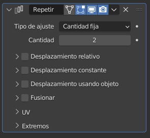

# U.T. 3 Modificadores
- [U.T. 3 Modificadores](#ut-3-modificadores)
  - [Generar](#generar)
    - [Repetir (Array)](#repetir-array)
      - [Ajustar a la longitud](#ajustar-a-la-longitud)
      - [Ajustar a la curva](#ajustar-a-la-curva)
    - [Biselar (Bevel)](#biselar-bevel)
    - [Booleana (Boolean)](#booleana-boolean)
    - [Construir (Build)](#construir-build)
    - [Diezmar (Decimate)](#diezmar-decimate)
    - [Dividir Bordes (Edge Split)](#dividir-bordes-edge-split)
    - [Nodos de geometría](#nodos-de-geometría)
    - [Máscara (Mask)](#máscara-mask)
    - [Simetrizar (Mirror)](#simetrizar-mirror)
    - [Multi-resolución (Multiresolution)](#multi-resolución-multiresolution)
    - [Rehacer malla (Remesh)](#rehacer-malla-remesh)
    - [Enroscar (Screw)](#enroscar-screw)
    - [Forrar (Skin)](#forrar-skin)
    - [Solidificar (Solidify)](#solidificar-solidify)
    - [Subdividr superficie (Subdivision Surface)](#subdividr-superficie-subdivision-surface)
    - [Triangular (Triangulate)](#triangular-triangulate)
    - [Volumen a malla](#volumen-a-malla)
    - [Fusionar (Weld)](#fusionar-weld)
    - [Estructura (Wireframe)](#estructura-wireframe)

## Generar

Los modificadores de este tipo cambian la geometría de la malla final al aplicarlo creando nuevas caras. Es importante recordar que no es hasta que se aplica el modificador que no se crean las caras, mientras tanto la geometría subyacente sigue siendo la misma y se puede cambiar para que el resultado final sea distinto.

### Repetir (Array)
Este modificador permite duplicar un objeto varias veces en la escena. Es muy útil por ejemplo en columnas, conjuntos de elementos repetidos como mesas, etc.

Es imprescindible determinar el número de objetos que tenemos que crear a partir de la base. Pueden ser un número fijo, o calculado a partir del resto de las propiedades. Definimos el modo de cálculo a través de la propiedad **tipo de ajuste**. En cantidad fija decimos el número exacto de copias, con las opciones ajustar a la longitud o ajustar a la copia el número se calculará en función de los desplazamientos que se fijarán a continuación.

Los objetos que creamos pueden desplazarse del original, de forma relativa a un objeto, de forma constante, o usando otro objeto como desplazamiento. Podemos combinar cualquiera de los tres modos para crear las copias o ninguno, dejando todas las copias en el mismo punto que el modelo.

- **Desplazamiento relativo**. Tomando como referencia la longitud total del objeto en el eje elegido, se multiplicará dicho número por el valor en el eje correspondiente. Es decir, si el objeto en el eje X mide dos unidades y en el desplazamiento ponemos 1 en el eje X, los centros de masas de la copia y el orgien estarán separados 2 unidades, si ponemos 2 estarán 4 unidades. 

- **Desplazamiento constante**. Distancia que existirá entre cada copia y la anterior entre sus centros de masas en el eje correspondiente. Así si la estblecemos a 3, siempre habrá tres unidades de diferencia.

- **Desplazamiento usando objeto**. En este caso se utilizarán las distancias del objeto original al que seleccionemos para tomarlas como distancias para los nuevos objetos.  . 
  En Naranja el objeto que sirve de referencia para el desplazamiento.

#### Ajustar a la longitud
Con esta opción podremos determinar la longitud máxima que tendrán las copias. El número de copias a hacer estará determinado por la propiedad longitud y por el desplazamiento que nosotros hagamos.

#### Ajustar a la curva
Utilizará la longitud de una curva para determinar el número de objetos junto con el desplazamiento.

### Biselar (Bevel)
Permite realizar la misma operación que la herramienta biselar.

Revisar la herramienta en la unidad anterior.

### Booleana (Boolean)

En cualquier caso se generará un nuevo objeto, como operación booleana de los dos seleccionados. El objeto que no tiene el modificador permanecerá inalterado, con lo que es recomendable ocultarlo para ver sus efectos.

Si no hemos aplicado el modificador, podemos mover la posición del segundo objeto para ver de forma dinámica cómo se aplica la operación.

Este modificador es muy útil para abrir agujeros o hacer cortes en las mallas, por ejemplo hucos de ventanas.

### Construir (Build)
Este modificador simula la creación del objeto final en una animación a lo largo de toda la tira de fotogramas, al final, en el último fotograma tendremos el objeto completo, y veremos como se va creando desde el fotograma uno.

Es necesaria que la malla tenga bastante definición para que quede bien, en nuestro caso no lo vamos a utilizar a generar videos.

### Diezmar (Decimate)
Reduce la complejidad de la malla generando un efecto de suavidad. El parámetro proporción determinará la cantidad, siendo 1 dejándola como está y 0.2 al 20% del original.

### Dividir Bordes (Edge Split)
El modificador Edge Split divide, duplica los bordes dentro de una malla, rompiendo los "vínculos" entre las caras alrededor de esos bordes divididos.

Todo lo que se puede hacer con este modificador se puede hacer con otras maneras más eficientes o directamente en el modo Edición. Se mantiene por razones históricas. A menos que realmente se necesites los cambios de topología que genera, no se recomienda usarlo en nuevos proyectos.

### Nodos de geometría 
Este modificador es muy avanzado para un curso introductorio. No lo vamos a utilizar.

### Máscara (Mask)

### Simetrizar (Mirror)
- Desde un objeto
### Multi-resolución (Multiresolution)
### Rehacer malla (Remesh)
### Enroscar (Screw)
### Forrar (Skin)
### Solidificar (Solidify)
### Subdividr superficie (Subdivision Surface)
### Triangular (Triangulate)
### Volumen a malla 
### Fusionar (Weld)
### Estructura (Wireframe)

---
[Siguiente](ut_3_03.md)
