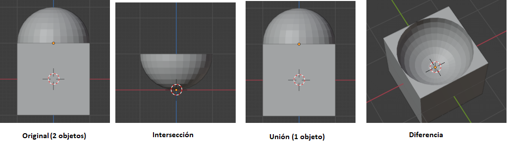

# U.T. 3 Modificadores
- [U.T. 3 Modificadores](#ut-3-modificadores)
  - [Generar](#generar)
    - [Repetir (Array)](#repetir-array)
      - [Ajustar a la longitud](#ajustar-a-la-longitud)
      - [Ajustar a la curva](#ajustar-a-la-curva)
    - [Biselar (Bevel)](#biselar-bevel)
    - [Booleana (Boolean)](#booleana-boolean)
    - [Construir (Build)](#construir-build)
    - [Diezmar (Decimate)](#diezmar-decimate)
    - [Dividir Bordes (Edge Split)](#dividir-bordes-edge-split)
    - [Nodos de geometría](#nodos-de-geometría)
    - [Máscara (Mask)](#máscara-mask)
    - [Simetrizar (Mirror)](#simetrizar-mirror)
    - [Multi-resolución (Multiresolution)](#multi-resolución-multiresolution)
    - [Rehacer malla (Remesh)](#rehacer-malla-remesh)
    - [Enroscar (Screw)](#enroscar-screw)
    - [Forrar (Skin)](#forrar-skin)
    - [Solidificar (Solidify)](#solidificar-solidify)
    - [Subdividir superficie (Subdivision Surface)](#subdividir-superficie-subdivision-surface)
    - [Triangular (Triangulate)](#triangular-triangulate)
    - [Volumen a malla](#volumen-a-malla)
    - [Fusionar (Weld)](#fusionar-weld)
    - [Estructura (Wireframe)](#estructura-wireframe)

## Generar

Los modificadores de este tipo cambian la geometría de la malla final al aplicarlo creando nuevas caras. Es importante recordar que no es hasta que se aplica el modificador que no se crean las caras, mientras tanto la geometría subyacente sigue siendo la misma y se puede cambiar para que el resultado final sea distinto.

### Repetir (Array)
Este modificador permite duplicar un objeto varias veces en la escena. Es muy útil por ejemplo en columnas, conjuntos de elementos repetidos como mesas, etc.

Es imprescindible determinar el número de objetos que tenemos que crear a partir de la base. Pueden ser un número fijo, o calculado a partir del resto de las propiedades. Definimos el modo de cálculo a través de la propiedad **tipo de ajuste**. En cantidad fija decimos el número exacto de copias, con las opciones ajustar a la longitud o ajustar a la copia el número se calculará en función de los desplazamientos que se fijarán a continuación.

Los objetos que creamos pueden desplazarse del original, de forma relativa a un objeto, de forma constante, o usando otro objeto como desplazamiento. Podemos combinar cualquiera de los tres modos para crear las copias o ninguno, dejando todas las copias en el mismo punto que el modelo.

- **Desplazamiento relativo**. Tomando como referencia la longitud total del objeto en el eje elegido, se multiplicará dicho número por el valor en el eje correspondiente. Es decir, si el objeto en el eje X mide dos unidades y en el desplazamiento ponemos 1 en el eje X, los centros de masas de la copia y el origen estarán separados 2 unidades, si ponemos 2 estarán 4 unidades. 

- **Desplazamiento constante**. Distancia que existirá entre cada copia y la anterior entre sus centros de masas en el eje correspondiente. Así si la establecemos a 3, siempre habrá tres unidades de diferencia.

- **Desplazamiento usando objeto**. En este caso se utilizarán las distancias del objeto original al que seleccionemos para tomarlas como distancias para los nuevos objetos.   .  
  En Naranja el objeto que sirve de referencia para el desplazamiento.

#### Ajustar a la longitud
Con esta opción podremos determinar la longitud máxima que tendrán las copias. El número de copias a hacer estará determinado por la propiedad longitud y por el desplazamiento que nosotros hagamos.

#### Ajustar a la curva
Utilizará la longitud de una curva para determinar el número de objetos junto con el desplazamiento.

### Biselar (Bevel)
Permite realizar la misma operación que la herramienta biselar.

 

Revisar la herramienta en la unidad anterior.

### Booleana (Boolean)

En cualquier caso, se generará un nuevo objeto, como operación booleana de los dos seleccionados. El objeto que no tiene el modificador permanecerá inalterado, con lo que es recomendable ocultarlo para ver sus efectos.

Si no hemos aplicado el modificador, podemos mover la posición del segundo objeto para ver de forma dinámica cómo se aplica la operación.

Este modificador es muy útil para abrir agujeros o hacer cortes en las mallas, por ejemplo, huecos de ventanas.

### Construir (Build)
Este modificador simula la creación del objeto final en una animación a lo largo de toda la tira de fotogramas, al final, en el último fotograma tendremos el objeto completo, y veremos cómo se va creando desde el fotograma uno.

Es necesaria que la malla tenga bastante definición para que quede bien, en nuestro caso no lo vamos a utilizar a generar videos.

### Diezmar (Decimate)
Reduce la complejidad de la malla generando un efecto de suavidad. El parámetro proporción determinará la cantidad, siendo 1 dejándola como está y 0.2 al 20% del original.

### Dividir Bordes (Edge Split)
El modificador Edge Split divide, duplica los bordes dentro de una malla, rompiendo los "vínculos" entre las caras alrededor de esos bordes divididos.

Todo lo que se puede hacer con este modificador se puede hacer con otras maneras más eficientes o directamente en el modo Edición. Se mantiene por razones históricas. A menos que realmente se necesites los cambios de topología que genera, no se recomienda usarlo en nuevos proyectos.

### Nodos de geometría 
Este modificador es muy avanzado para un curso introductorio. No lo vamos a utilizar.

### Máscara (Mask)
Este modificador permite ocultar conjuntos de vértices de forma dinámica. Este curso no hemos abordado los grupos de vértices por lo que no se va a explicar.

### Simetrizar (Mirror)
Permite hacer simétrico un objeto con respecto alguno de sus ejes. Se tomará de referencia el **centro de masas del objeto (punto naranja) ** para hacer la simetría.

Si en vez del centro de masas, deseamos usar otro objeto lo podemos seleccionar en la caja correspondiente para hacer uso de él. En la siguiente imagen se ve como usamos un plano para hacer una simetría en el eje Z.

### Multi-resolución (Multiresolution)
Permite dividir una malla al igual que la operación de subdividir. Podemos determinar el número de niveles a aplicar en los diferentes modos de proceso: Vista o procesamiento. 

### Rehacer malla (Remesh)

Este modificador permite cambiar la geometría de la malla de cuatro formas diferentes. Cada una admite parámetros para controlar la definición de la malla final.

### Enroscar (Screw)
Este modificador permite realizar figuras rotadas de forma fácil. Hay que tener en cuenta dos aspectos claves antes de ponerse con él. Utiliza como referencia los ejes locales para la rotación en vez de los globales, con lo que cualquier posicionamiento del objeto deberá hacerse en modo Edición. Y para el centro de rotación usa el centro de masas, por lo que desplazaremos el objeto en modo edición para las rotaciones.

>**Veamos un ejemplo. ** 
1º.- Creamos una escena con un círculo.  
2º.- Cambiamos al **modo Edición**.  
3º.- Rotamos el círculo 90º en el eje X.  
4º.- Aplicamos el modificador Enroscar en el eje Z con 360º y 1 iteración y enroscar a cero.  
 
5º.- Desplazamos el círculo 4 unidades en el eje X.  
6º.- Cambiamos la propiedad enroscar a 4. Se empieza a ver el giro.  
 
7.- Por último, cambiamos la propiedad Iteraciones a 4.  

Este modificador es fácil, pero hay que entender los principios del giro. Primero orientar la forma en el sentido correcto que queremos girar, y segundo establecer el punto de giro (punto naranja) en la posición adecuada. Teniendo en cuenta que el giro se hará siempre en el eje local del objeto, con lo que el posicionamiento del objeto se debe realizar en modo Edición.

>**Ejercicio** 
Repetir el ejercicio anterior, pero realizando los desplazamientos en modo objeto.

### Forrar (Skin)
Permite crear una malla sólida alrededor de aristas de forma rápida.

### Solidificar (Solidify)
Podemos añadir profundidad y grosor a una forma con este modificador. Tiene dos modos de funcionamiento

**Simple**
Este es el algoritmo de solidificación por defecto, que simplemente extruye la geometría. Este algoritmo no funciona en geometría donde las aristas tienen más de dos caras adyacentes.

>**Importante**
Si las normales de las caras adyacentes no apuntan a la misma dirección general, el modo simple no podrá solidificar el límite entre ellas. Esto sucede si las normales no son recalculadas o por ejemplo en superficies de un solo lado como una tira de Möbius.

**Complejo**
Este algoritmo de solidificación puede manejar cualquier situación geométrica para garantizar una geometría de salida. Es capaz de solidificar formas como tiras de Möbius, botellas de Klein, diseños de paredes arquitectónicas y muchas más que el Modo Simple no es capaz de hacer. 

### Subdividir superficie (Subdivision Surface)
Al igual que el comando subdividir, hace que la malla tenga una mayor densidad. Permite dos tipos de algoritmos para las divisiones, el algoritmo *simple* divide simplemente la malla, mientras que el algoritmo *Catmull-Clark* permite suavizar a la vez la malla.

La división se controla con el parámetro vistas, procesar que indicará el número de subdivisiones de la malla. 

### Triangular (Triangulate)
Este modificador convierte las caras en triángulos independientemente del número de vértices que tenga la cara.

### Volumen a malla 
Este modificador no lo vamos a estudiar en este curso.

### Fusionar (Weld)
Busca grupos de vértices cercanos y los convierte en uno uniéndolos, podemos determinar la distancia máxima a la que deben encontrarse entre sí los vértices y si dichos vértices estarán o no conectados para poder fusionarse.

### Estructura (Wireframe)
El modificador transforma cada arista dándola un volumen determinado creando a su alrededor nuevas caras. Fijamos el grosor de las nuevas caras como más importante.

---
[Siguiente](ut_3_03.md)
