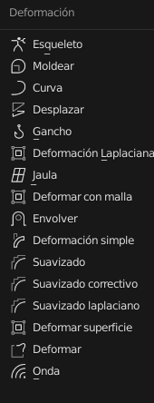
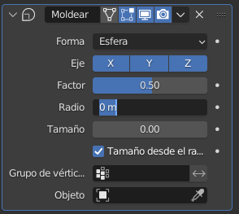
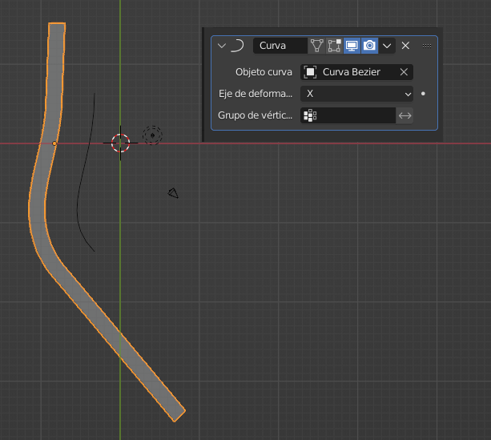
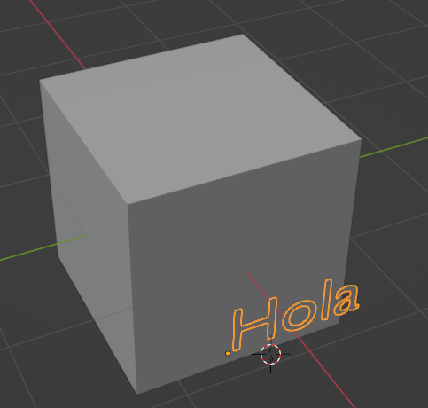
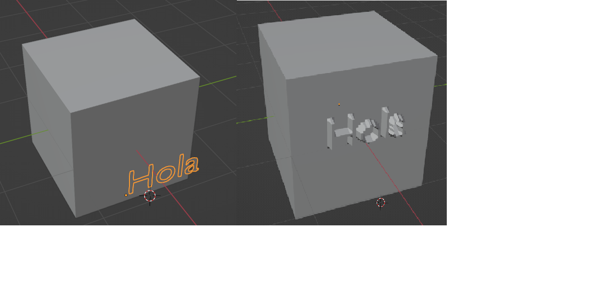
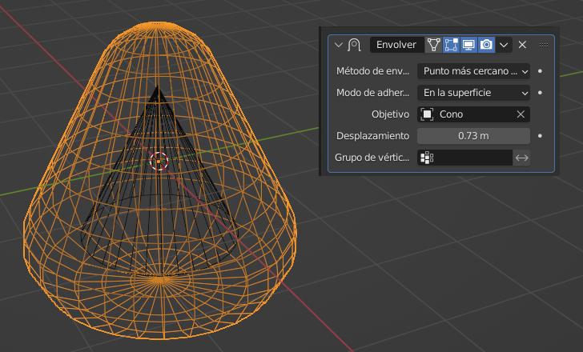
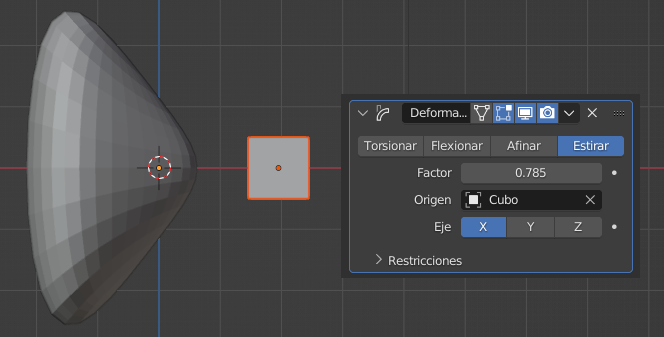
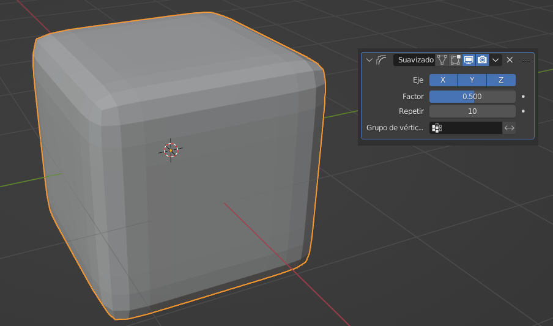

# U.T. 3 Modificadores
- [U.T. 3 Modificadores](#ut-3-modificadores)
  - [Deformar](#deformar)
    - [Esqueleto (Armature)](#esqueleto-armature)
    - [Moldear (Cast)](#moldear-cast)
    - [Curva (Curve)](#curva-curve)
    - [Desplazar (Displace)](#desplazar-displace)
    - [Gancho (Hook)](#gancho-hook)
    - [Deformación laplaciana (Laplacian Deform)](#deformación-laplaciana-laplacian-deform)
    - [Jaula (Lattice)](#jaula-lattice)
    - [Deformación con malla (Mesh Deform)](#deformación-con-malla-mesh-deform)
    - [Envolver (Shrinkwrap)](#envolver-shrinkwrap)
    - [Deformación simple (Simple Deform)](#deformación-simple-simple-deform)
    - [Suavizado (Smooth)](#suavizado-smooth)
    - [Suavizado correctivo (Smooth Corrective)](#suavizado-correctivo-smooth-corrective)
    - [Suavizado Laplacian  (Smooth Laplaciano)](#suavizado-laplacian--smooth-laplaciano)
    - [Deformación superifcie (Surface Deform)](#deformación-superifcie-surface-deform)
    - [Deformar (Warp)](#deformar-warp)
    - [Onda (wave)](#onda-wave)

## Deformar

Los modificadores de este tipo cambian la geometría de la malla final pero sin añadir más complejidad a la malla. Es importante recordar que no es hasta que se aplica el modificador que no se crean las caras, mientras tanto la geometría subyacente sigue siendo la misma y se puede cambiar para que el resultado final sea distinto.

### Esqueleto (Armature)
Utilizado para crear sistemas de huesos y dotar al objeto de movimiento para la realización de videos. No los vamos a utilizar en este curso.

### Moldear (Cast)
Este modificador permite cambiar la forma de la malla para hacerla similar a otra (esfera, cilindro o cubo). Podemos fijar los ejes en los que se realizará la deformación así como el factor a aplicar a la misma. La forma está controlada por los tres parámetros: Factor, Radio y Tamaño.

Hay que tener en cuenta que para que la deformación se aplique, la malla tiene que ser densa. Si utilizamos un cubo tal cual, no apreciaremos deformación alguna, pero si este cubo lo subdividimos varias veces empezamos a ver cómo actúal el modificador.

Por último, una característica bastante interesante para la generación de video, es que se puede usar otro objeto para determinar la deformación. Este objeto, generalmente del grupo **vacío** se puede seleccionar en la correspondiente propiedad **Objeto** y posteriormente animar para ver el efecto que surge.

### Curva (Curve)
La curva nos permite modificar la forma de una malla en función de una curva que elijamos.

En la imagen vemos un cubo escalado en el eje Y 10 veces y dividido 100, después aplicar el modificador con la curva que hay junto a él. 

La ventaja de este tipo de modificadores es que si cambiamos la posición, en este caso de la curva, del objeto que define la transformación se cambiará la transformación en sí misma. Así al mover la curva en los ejes X e Y se verá otra forma en el cubo.

### Desplazar (Displace)
Desplaza un conjunto de vértices en función del brillo de una textura que seleccionemos. 

### Gancho (Hook)
Asigna un conjunto de vértices a nuevo objeto **Vacío**. Si desplazamos el objeto vacío, los vértices asociados se desplazarán de la misma forma. Se usa principalmente en animaciones.

### Deformación laplaciana (Laplacian Deform)
Permite modificar la forma como se ve en modo **Objeto** manteniendo la malla original sin tocar (modo **Edición**)

### Jaula (Lattice)
Es usado para deformar la malla de un objeto o controlar el movimiento de partículas. No lo vamos a usar.

### Deformación con malla (Mesh Deform)
Similar al anterior, pero usando una malla para la deformación. No lo vamos a usar.

### Envolver (Shrinkwrap)
Permite deformar una malla con la forma de otro objeto. El resultado es como si añadiéramos el objeto al original desplazándo vértices.

>**Ejemplo** 
1º.- Creamos una nueva escena.  
2º.- Subdividimos el cubo dos veces hasta 50 divisiones.  
3º.- Añadimos el Texto Hola y lo escalamos para encajar en una cara.  

4º.- Convertirmos el texto en malla, botón secundario del ratón.  
6º.- Aplicamos el modificador con *Proyectar*, *sobre la superficie*.  
7º.- Ocultamos el texto

Es un modificador muy interesante que debemos explorar con más detalle sus propiedades. En concreto coge un objeto como referencia y modifica otro tomando la forma del primero.

En la imagen anterior, una esfera con el modificador aplicado con el cono como referencia y cambiado el valor de desplazamiento.

### Deformación simple (Simple Deform)
Permite realizar cuatro deformaciones básicas sobre un objeto transformando un objeto de referencia. En la imagen siguiente el cubo se usa como referencia y al moverlo cambia la deformación

### Suavizado (Smooth)
Suaviza un objeto. La malla debe tener cierta densidad para ver su efecto.

### Suavizado correctivo (Smooth Corrective)
Este modificador se utiliza con los esqueletos, no lo vamos a ver.

### Suavizado Laplacian  (Smooth Laplaciano)
Similar al Suavizado pero usando otros parámetros.

### Deformación superifcie (Surface Deform)
Similar a deformar con malla. No lo vamos a usar.

### Deformar (Warp) 
Permite deformar un objeto utilizando como base otros objetos. No lo vamos a usar.

### Onda (wave)
Crea una simulación de onda sobre una superficie, al ser una animación no lo vamos a usar.

---
[Siguiente](ut_3_04.md)
