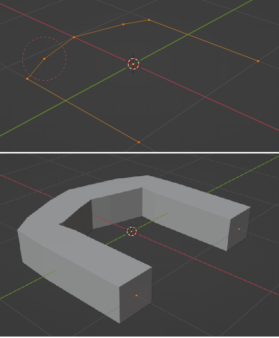

# U.T. 3 Modificadores
- [U.T. 3 Modificadores](#ut-3-modificadores)
  - [Deformar](#deformar)
    - [Esqueleto (Armature)](#esqueleto-armature)
    - [Moldear (Cast)](#moldear-cast)
    - [Curva (Curve)](#curva-curve)
    - [Desplazar (Displace)](#desplazar-displace)
    - [Gancho (Hook)](#gancho-hook)
    - [Deformación laplaciana (Laplacian Deform)](#deformación-laplaciana-laplacian-deform)
    - [Jaula (Lattice)](#jaula-lattice)
    - [Deformación con malla (Mesh Deform)](#deformación-con-malla-mesh-deform)
    - [Envolver (Shrinkwrap)](#envolver-shrinkwrap)
    - [Deformación simple (Simple Deform)](#deformación-simple-simple-deform)
    - [Suavizado (Smooth)](#suavizado-smooth)
    - [Suavizado correctivo (Smooth Corrective)](#suavizado-correctivo-smooth-corrective)
    - [Suavizado Laplacian  (Smooth Laplaciano)](#suavizado-laplacian--smooth-laplaciano)
    - [Deformación superfcie (Surface Deform)](#deformación-superfcie-surface-deform)
    - [Deformar (Warp)](#deformar-warp)
    - [Onda (wave)](#onda-wave)

## Deformar

### Esqueleto (Armature)
### Moldear (Cast)
### Curva (Curve)
### Desplazar (Displace)
### Gancho (Hook)
### Deformación laplaciana (Laplacian Deform)
### Jaula (Lattice)
### Deformación con malla (Mesh Deform)
### Envolver (Shrinkwrap)
### Deformación simple (Simple Deform)
### Suavizado (Smooth)
### Suavizado correctivo (Smooth Corrective)
### Suavizado Laplacian  (Smooth Laplaciano)
### Deformación superfcie (Surface Deform)
### Deformar (Warp) 
### Onda (wave)

---
[Siguiente](ut_3_04.md)
