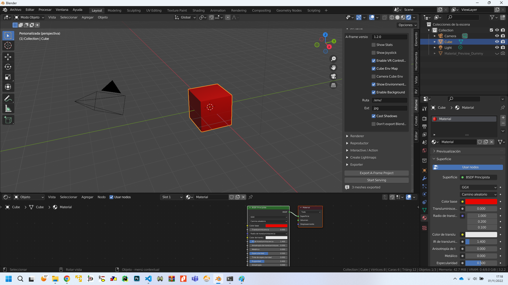
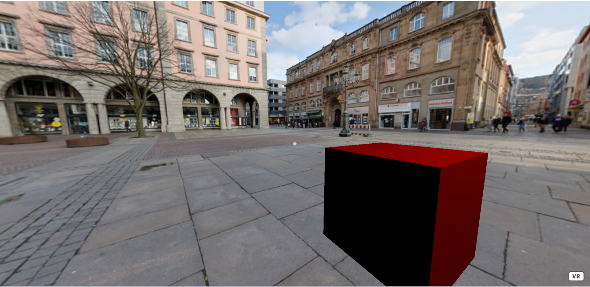
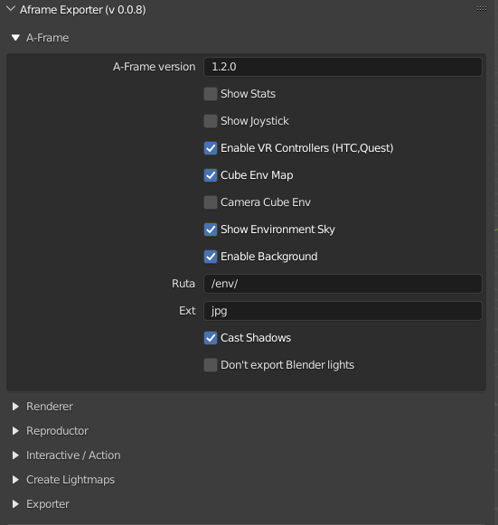
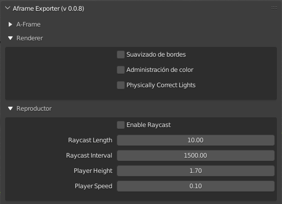
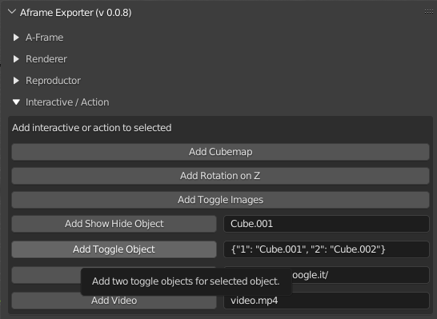
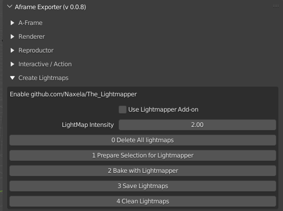
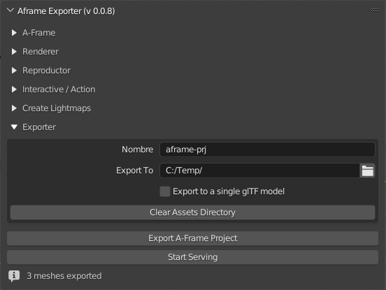

# U.T. 5 A-Frame
- [U.T. 5 A-Frame](#ut-5-a-frame)
  - [Creación del entorno virtual con blender](#creación-del-entorno-virtual-con-blender)
    - [instalación del plugin](#instalación-del-plugin)
    - [exportar un objeto simple](#exportar-un-objeto-simple)
    - [exportar un entorno de base](#exportar-un-entorno-de-base)
      - [configuraciones de la exportación](#configuraciones-de-la-exportación)
      - [Consideraciones sobre los materiales](#consideraciones-sobre-los-materiales)
      - [Generación del código HTML](#generación-del-código-html)

## Creación del entorno virtual con blender
>**En la versión 3.3 de blender falla el plugin (0.0.8), hay que usar la versión 3.2 de blender.**
### instalación del plugin
1.- Descargar el código plugin 0.0.8 para la versión 3.2 de blender: https://silverslade.itch.io/a-frame-blender-exporter o https://github.com/silverslade/aframe_blender_exporter
2.- Instalarlo en **Edit -> Preferences -> Add-ons -> Install**
3.- Buscar el fichero zip descargado.
4.- Habilitart el plugin.
5.- Creasr la escena bajo blender.
6.- Elegir la pestaña "Aframe".
7.- Establecer las preferencias.
8.- Exportar
9.- Copiar el código generado en un servidor Web (XAmp).

### exportar un objeto simple
- Crear la siguiente escena

  - Establecer los parámetros de Aframe como la imagen.
  - Pulsar Export.
- Copiar el directorio c:\temp\aframe-prj en el directorio htdocs del servidor.
- Arrancar el servidor Apache
- Navegar a https://localhost/aframe-prj

### exportar un entorno de base
Crearemos el entorno bajo blender y lo exportaremos teniendo en cuenta usar los materiales más simples posioble y no incorporar elementos dinámicos que se harán posteriormente, solo el interfaz a crear.
#### configuraciones de la exportación

|Propiedad|Descripción|Valor por defecto|
|--|--|--|
|A-Frame|A-Frame Version|1.2.0
|Show Stats|Muestra la ventana de estadísticas, solo para depuración|False
|Show Joystick|Muestra controles para mover la posición del actor|False
|Enable VR Controllers (HTC, Quest)|Activa los controles par VR por defecto|False
|Cube Env Map|Activa los reflejos del cielo, no los de los objetos. Hay que activar tambiénm Camera Cube Env para afectar a los objetos.|False
|Camera Cube Env|Activa los objetos en los objetos|False
|Show Enviroment Sky|Activa el cielo por defecto|False
|Enable Background|Activa el fondo por defecto|False
|Path	directory|Path donde almacenar los recursos del cielo|/env/
|Ext|Extensión para las imágenes por defecto|jpg
|Cast Shadows|Activa las sombras y luces dinámicas|False
|Dont't export blender lights| No exporta las luces de la escena blender| False

|Propiedad|Descripción|Valor por defecto|
|--|--|--|
|Antialiasing|Activar el antialiasing de la escena|False
|Color Management|Activar la gestión de color.|False
|Physically Correct Lights|Activar la corrección de luces|False

|Propiedad|Descripción|Valor por defecto|
|--|--|--|
|Enable Raycast|Activa el tracado de rayos para el renderizado, se puede establecer la longitud y el intervalo.|False
|Raycast Length|Longitud del rayo. Valores menores genera mejor rendimiento|10.0
|Raycast Interval|Intervalo en milisegundos de los rayos. Valores mayores proporciona mejor rendimiento.|1500.0
|Player Height|Altura de la cámara|1.70
|Player Speed|Velocidad de desplazamiento|0.1

|Propiedad|Descripción|
|--|--|
|Add Cubemap|Activa los reflejkos para el objeto seleccionado.
|Add Rotation on Z|Rota el objeto seleccionado en el eje Z indefinidamente.
|Add Toggle Images|Establece dos imágenes para el objeto, una para no seleccionado y otra para seleccionado.
|Add Show Hide Object| Añade un objeto al mostrar u ocultar.
|Add Toggle Object| Añade dos objetos para ser intercambiados al pulsar.
|Add Link Web|Activa una url a la que saltar al pulsar.
|Add Video|Añade un video a mostrar en un plano (plane mesh)

|Propiedad|Descripción|
|--|--|
|Use Lightmapper Add-on| Para crear los mapas de luz. Si se selecciona se usarán los mapas de luz generados para las mallas.	
|0 "Delete all Lightmaps"|	Borra todos los mapas generados	
|1 "Prepare Selection for Lightmapper"|	Selecicona los objetos y establece la configuración para crear los mapas de luz.
|2 "Bake with Lightmapper"|	Crea los mapas de luz, el proceso puede ser lento, hay que mirar la consola de blender para comprobar el proceso.(Window -> System Console)
|3 "Save Lightmaps"|	Se almacenan los mapas de luz en el directorio correspondiente para usar posteriormente.	
|4 "Clean Lightmaps"|	Es obligatorio como último paso ya que cambios en los sobredores pueden ser incompatibles con A-Frame.

|Propiedad|Descripción|Valor por defecto|
|--|--|
|Name|	Nombre del proyecto. Es nombre del directorio que se creará|aframe-prj
|Export To|	Directorio en el que se exportartá el proyecto	|C:/temp/
|Export to a single glTf model| Exporta todo en un único objeto.
|Clear Assets Directory|	Para borrar los objetos exportados antes en el directorio correspondiente.	

|Propiedad|Descripción|
|--|--|
|Export A-Frame Project| Exporta el proyecrto.
|Start Serving| Comenzar el servidor Web incorporado.
|Stop Serving| Terminar el servidor Web incorporado.

#### Consideraciones sobre los materiales
- Se pueden utilizar materiales simples, como colores.
- Se pueden utilizar texturas con imágenes.
#### Generación del código HTML
    <!doctype html>
    <html lang="en">
        <!-- Generated automatically by AFRAME Exporter for Blender - https://silverslade.itch.io/a-frame-blender-exporter -->
        <head>
            <title>WebXR Application</title>
            <link rel="icon" type="image/png" href="favicon.ico"/>
            <meta name="description" content="3D Application">
            <meta charset="utf-8">
            <meta http-equiv="X-UA-Compatible" content="IE=edge">
            <meta name="viewport" content="width=device-width, initial-scale=1">
            
            
            
            
            
            
            <link rel="stylesheet" type="text/css" href="style.css">
        </head>
        <body onload="init();">
            <a-scene   shadow="type: pcfsoft; autoUpdate: true;" renderer="antialias: false; colorManagement: false; physicallyCorrectLights: false;">
                <!-- Assets -->
                  <a-assets>
                    <a-asset-item id="Cube" src="./assets/Cube.gltf"></a-asset-item>
                    <a-asset-item id="Material_Preview_Dummy" src="./assets/Material_Preview_Dummy.gltf"></a-asset-item>
                    
                    
                    
                    
                    
                    
                    
                  </a-assets>

                <!-- Entities -->
                
                  <a-entity id="#Cube" gltf-model="#Cube" scale="1 1 1" position="0.0 0.0 -0.0" visible="true" shadow="cast: true" ></a-entity>
                  <a-entity id="#Material_Preview_Dummy" gltf-model="#Material_Preview_Dummy" scale="1 1 1" position="0.0 0.0 -0.0" visible="true" shadow="cast: true" ></a-entity>

                <!-- Camera -->
                  <a-entity id="player" 
                    position="0 -0.2 0" 
                    movement-controls="speed: 0.10000000149011612;">
                    <a-entity id="camera" 
                        camera="near: 0.001" 
                        position="0 1.7000000476837158 0" 
                        look-controls="pointerLockEnabled: true">
                                <a-entity id="cursor" cursor="fuse: false;" animation__click="property: scale; startEvents: click; easing: easeInCubic; dur: 50; from: 	0.1 0.1 0.1; to: 1 1 1"
                                position="0 0 -0.1"
                                geometry="primitive: circle; radius: 0.001;"
                                material="color: #CCC; shader: flat;"
                                ></a-entity>
                    </a-entity>
                    <a-entity id="leftHand" oculus-touch-controls="hand: left" vive-controls="hand: left"></a-entity>
                    <a-entity id="rightHand" laser-controls oculus-touch-controls="hand: right" vive-controls="hand: right" ></a-entity>
                  </a-entity>

                <!-- Lights -->
                
                  <a-entity position="4.076245307922363 5.903861999511719 -1.0054539442062378" light="castShadow:true; color:#ffffff; distance:40.0; type:point; intensity:1.0; shadowBias: -0.001; shadowCameraFar: 501.02; shadowCameraBottom: 12; shadowCameraFov: 101.79; shadowCameraNear: 0; shadowCameraTop: -5; shadowCameraRight: 10; shadowCameraLeft: -10; shadowRadius: 2;"></a-entity>

                <!-- Sky -->
                  <a-sky src="#sky" material="" geometry="" rotation="0 90 0"></a-sky>
            </a-scene>
        </body>
    </html>
<!-- Generated automatically by AFRAME Exporter for Blender - https://silverslade.itch.io/a-frame-blender-exporter -->

---
[Siguiente](ut_5_03.md)
