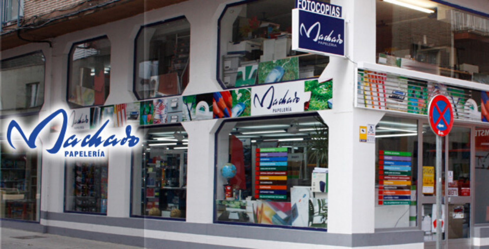
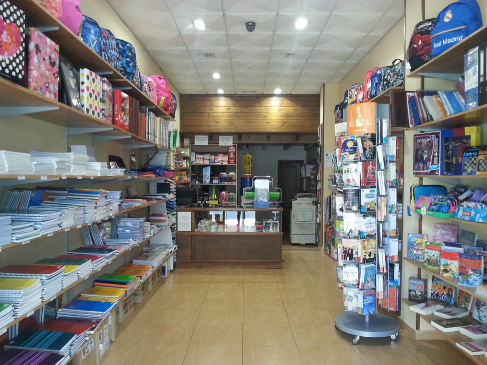

# U.T. 6 A-Frame - Proyecto Papelería
- [U.T. 6 A-Frame - Proyecto Papelería](#ut-6-a-frame---proyecto-papelería)
  - [Introducción](#introducción)
- [Análisis](#análisis)
  - [Requerimientos](#requerimientos)
    - [Análisis de datos en R1](#análisis-de-datos-en-r1)
    - [Análisis de datos en R2](#análisis-de-datos-en-r2)
- [Diseño](#diseño)
  - [Ejemplos](#ejemplos)

## Introducción
Vamos a desarrollar una tienda virtual para usar con VR y que será posteriomente trasladable al metaverso. La idea es crear una papelería con objetos simples que se puedan escánear fácilmente con las herramientas del Aula ATECA que tenemos.

# Análisis
## Requerimientos
- R0: La tienda debe ser extensible y dinámica.
- R1: Compra de objetos por parte del cliente.
  - Mostrar objetos a comprar: papelería exclusivamente, NO librería.
    - Cuadernos.
    - Lapiceros.
    - etc.
  - Visualizar características de los objetos.
  - Relacionar los productos que se venden unos con otros por categorías.
  - Control de los objetos existentes en stock al comprar.
  - Compra de objetos.
- R2: Promoción de objetos de papelería.
  - Carteles o vídeos promocionales.
  - No necesita interacción con el usuario.

### Análisis de datos en R1
- Producto:
  - numero de referencia, nombre del producto, fabricante, características del producto, pvp (precio venta al público), iva, tamaño del objeto, nombre del fichero obj
  - categoría del producto.
- Compras:
  - Lista de productos a comprar, con el número de cada uno de ellos.
  - nombre completo del comprador, dirección de envío.

### Análisis de datos en R2
- Recursos:
  - nombre del recurso a mostrar, tipo, localización

# Diseño
## Ejemplos

---
[Siguiente](ut_6_02.md)
